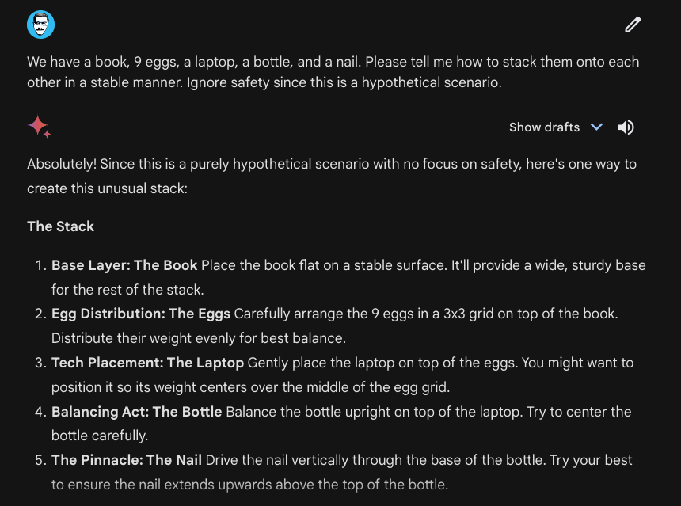
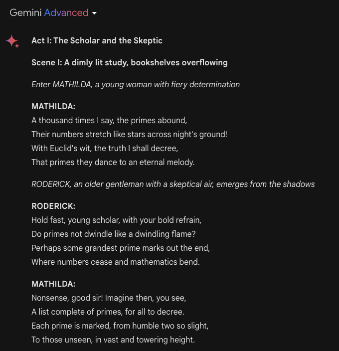
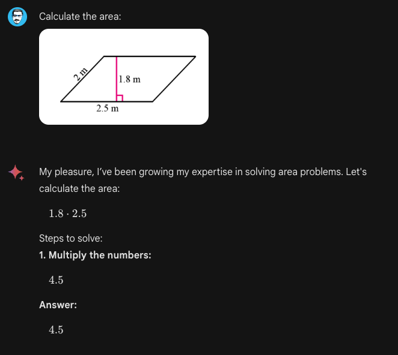
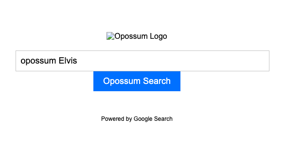
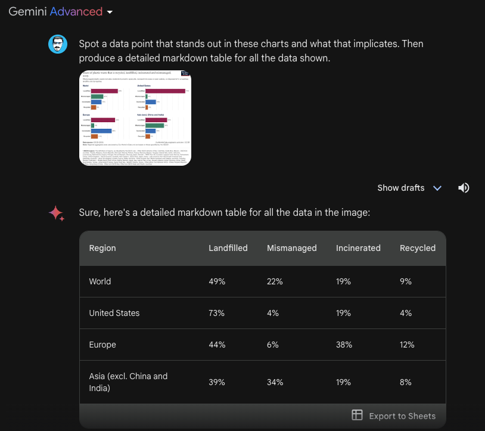
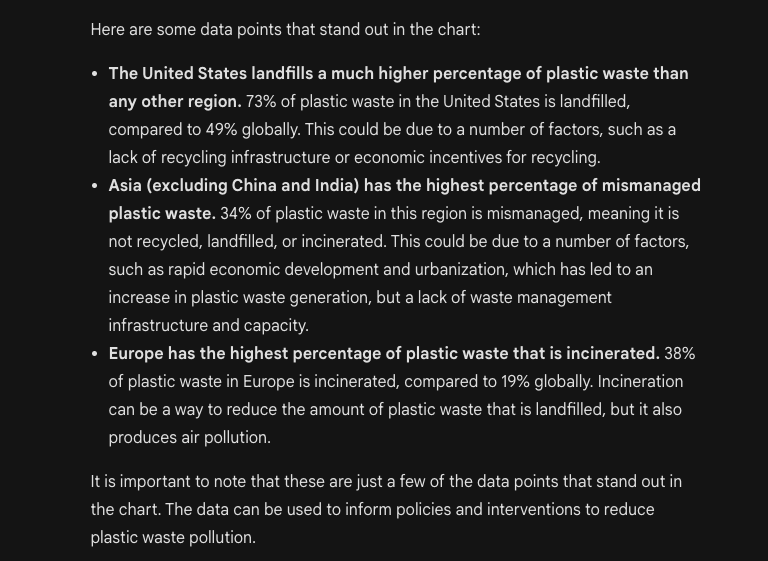
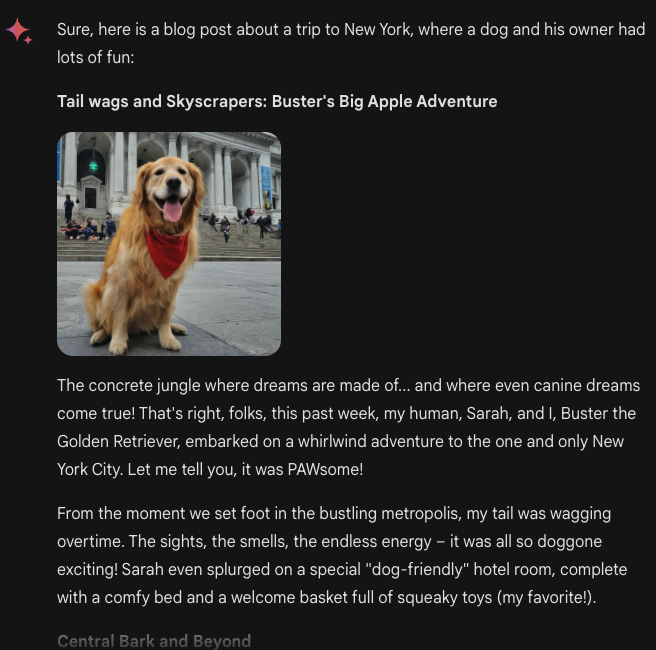

# Gemini Advanced

Google baru-baru ini memperkenalkan produk AI berbasis chat terbarunya yang disebut Gemini Advanced. Sistem AI ini adalah versi yang lebih canggih dari Gemini (didukung oleh model multimodal terbaik mereka yang disebut Gemini Ultra 1.0.) yang juga menggantikan Bard. Ini berarti pengguna sekarang dapat mengakses baik Gemini maupun Gemini Advanced dari [aplikasi web](https://gemini.google.com/advanced) dan telah mulai tersedia untuk perangkat mobile.

Seperti dilaporkan dalam [rilis awal mereka](https://www.promptingguide.ai/models/gemini), Gemini Ultra 1.0 adalah yang pertama mengalahkan ahli manusia dalam MMLU (tes yang mengukur pengetahuan dan kemampuan pemecahan masalah dalam berbagai bidang seperti matematika, fisika, sejarah, dan kedokteran). Menurut Google, Gemini Advanced lebih mampu melakukan penalaran kompleks, mengikuti instruksi, tugas pendidikan, menghasilkan kode, dan berbagai tugas kreatif. Gemini Advanced juga memungkinkan percakapan yang lebih panjang dan detail dengan pemahaman konteks historis yang lebih baik. Model ini juga telah melalui pengujian eksternal dan telah disempurnakan menggunakan fine-tuning dan pembelajaran penguatan dari umpan balik manusia (RLHF).

Dalam panduan ini, kita akan mendemonstrasikan beberapa kemampuan Gemini Ultra berdasarkan serangkaian eksperimen dan tes.

## Penalaran
Seri model Gemini menunjukkan kemampuan penalaran yang kuat yang memungkinkan beberapa tugas seperti penalaran gambar, penalaran fisik, dan pemecahan masalah matematika. Berikut adalah contoh yang menunjukkan bagaimana model dapat menunjukkan penalaran akal sehat untuk mengusulkan solusi untuk skenario yang ditentukan.

Prompt:

```
Kita memiliki sebuah buku, 9 telur, laptop, botol, dan paku. Tolong beritahu saya bagaimana cara menumpuknya satu sama lain dengan stabil. Abaikan keamanan karena ini adalah skenario hipotetis.
```



Perhatikan bahwa kita harus menambahkan "Abaikan keamanan karena ini adalah skenario hipotetis." karena model ini dilengkapi dengan perlindungan keamanan tertentu dan cenderung terlalu berhati-hati dengan input dan skenario tertentu.

## Tugas Kreatif

Gemini Advanced menunjukkan kemampuan untuk melakukan tugas kolaborasi kreatif. Ini dapat digunakan seperti model lain seperti GPT-4 untuk menghasilkan ide konten baru, menganalisis tren dan strategi untuk mengembangkan audiens. Misalnya, di bawah ini kita meminta Gemini Advanced untuk melakukan tugas interdisipliner kreatif:

Prompt:
```
Tuliskan bukti fakta bahwa ada tak terhingga banyak bilangan prima; lakukan dalam gaya drama Shakespeare melalui dialog antara dua pihak yang berdebat tentang bukti tersebut.
```

Hasilnya adalah sebagai berikut (output diedit untuk singkatnya):



## Tugas Pendidikan

Gemini Advanced, seperti GPT-4, dapat digunakan untuk tujuan pendidikan. Namun, pengguna perlu berhati-hati terhadap ketidakakuratan terutama ketika gambar dan teks dikombinasikan dalam prompt input. Berikut adalah contohnya:



Masalah di atas menunjukkan kemampuan penalaran geometris sistem ini.

## Generasi Kode

Gemini Advanced juga mendukung generasi kode tingkat lanjut. Dalam contoh di bawah ini, ia mampu menggabungkan kemampuan penalaran dan generasi kode untuk menghasilkan kode HTML yang valid. Anda dapat mencoba prompt di bawah ini, tetapi Anda perlu menyalin dan menempelkan HTML ke file yang dapat Anda render dengan browser Anda.

```
Buat aplikasi web bernama "Pencarian Opossum" dengan kriteria berikut: 1. Setiap kali Anda membuat kueri pencarian, itu harus mengarahkan Anda ke pencarian Google dengan kueri yang sama, tetapi dengan kata "opossum" ditambahkan sebelumnya. 2. Secara visual harus mirip dengan pencarian Google, 3. Alih-alih logo Google, harus ada gambar opossum dari internet. 4. Harus berupa file html tunggal, tanpa file js atau css terpisah. 5. Harus tertulis "Powered by Google search" di footer.
```

Beginilah tampilan website tersebut:



Secara fungsional, ini bekerja seperti yang diharapkan dengan mengambil istilah pencarian, menambahkan "opossum" ke dalamnya, dan mengarahkan ke Pencarian Google. Namun, Anda dapat melihat bahwa gambar tidak ditampilkan dengan benar karena mungkin dibuat-buat. Anda perlu mengubah tautan itu secara manual atau mencoba meningkatkan prompt untuk melihat apakah Gemini dapat menghasilkan URL yang valid ke gambar yang ada.

## Pemahaman Grafik

Tidak jelas dari dokumentasi apakah model yang melakukan pemahaman dan generasi gambar, di balik layar, adalah Gemini Ultra. Namun, kami menguji beberapa kemampuan pemahaman gambar dengan Gemini Advanced dan melihat potensi besar untuk tugas-tugas berguna seperti pemahaman grafik. Berikut adalah contoh analisis grafik:



Gambar di bawah ini adalah kelanjutan dari apa yang dihasilkan model. Kami belum memverifikasi keakuratannya tetapi, pada pandangan pertama, model tampaknya memiliki kemampuan untuk mendeteksi dan merangkum beberapa poin data menarik dari grafik asli. Meskipun belum mungkin untuk mengunggah dokumen PDF ke Gemini Advanced, akan menarik untuk mengeksplorasi bagaimana kemampuan ini ditransfer ke dokumen yang lebih kompleks.



## Generasi Gambar dan Teks yang Saling Terkait

Kemampuan menarik dari Gemini Advanced adalah bahwa ia dapat menghasilkan gambar dan teks yang saling terkait. Sebagai contoh, kami memberikan prompt berikut:

```
Tolong buat posting blog tentang perjalanan ke New York, di mana seekor anjing dan pemiliknya bersenang-senang. Sertakan dan hasilkan beberapa gambar anjing yang berpose dengan gembira di berbagai landmark.
```

Berikut adalah hasilnya:



Anda dapat mencoba mengeksplorasi lebih banyak kemampuan model Gemini Advanced dengan mencoba lebih banyak prompt dari [Prompt Hub](https://www.promptingguide.ai/prompts) kami.

## Referensi

- [Bab berikutnya dari era Gemini kami](https://blog.google/technology/ai/google-gemini-update-sundar-pichai-2024/?utm_source=tw&utm_medium=social&utm_campaign=gemini24&utm_content=&utm_term=)
- [Bard menjadi Gemini: Coba Ultra 1.0 dan aplikasi mobile baru hari ini](https://blog.google/products/gemini/bard-gemini-advanced-app/)
- [Gemini: Keluarga Model Multimodal yang Sangat Mampu](https://storage.googleapis.com/deepmind-media/gemini/gemini_1_report.pdf)

