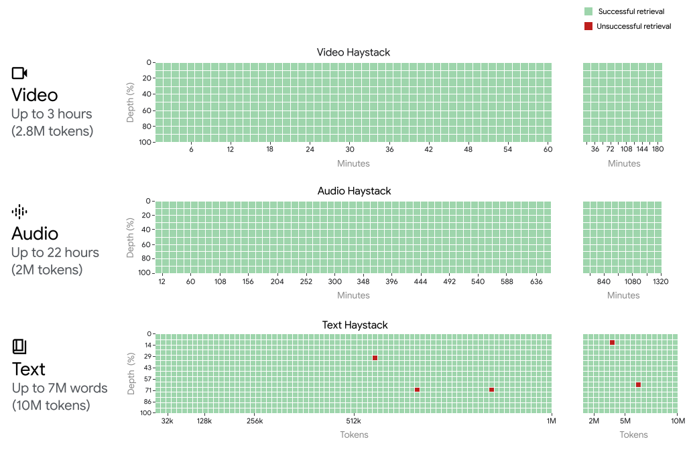
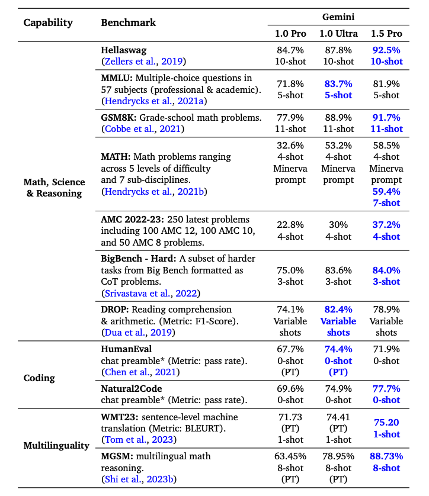
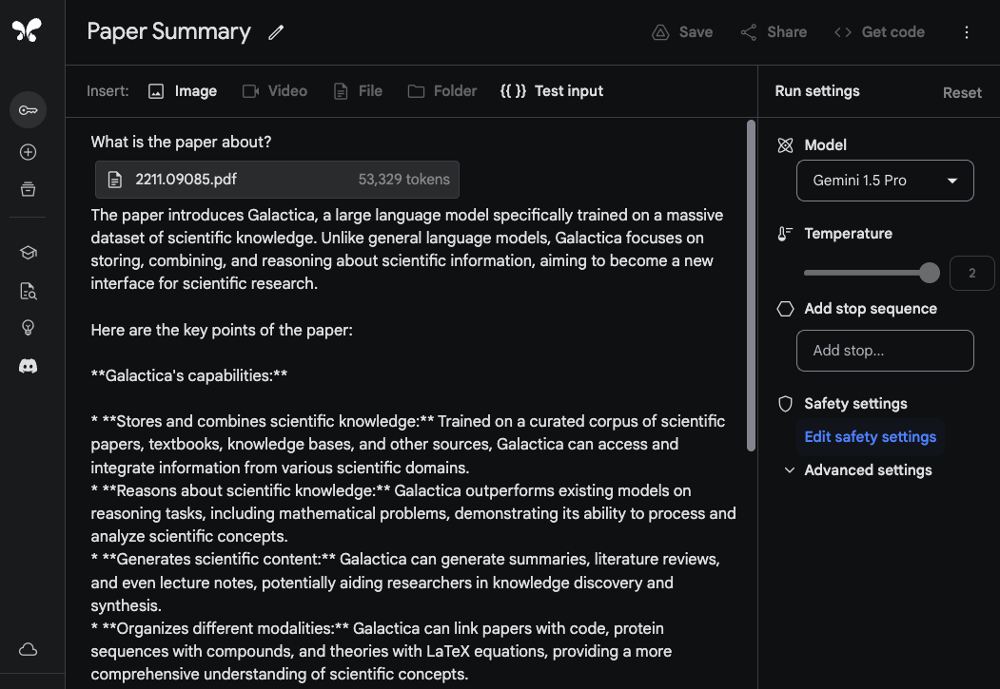
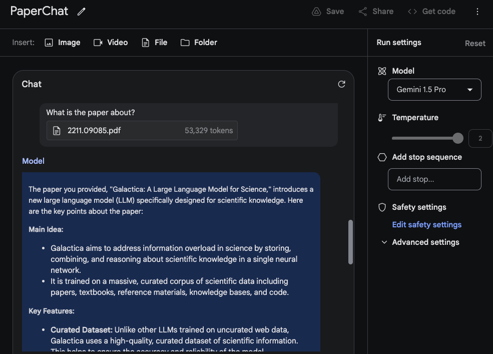
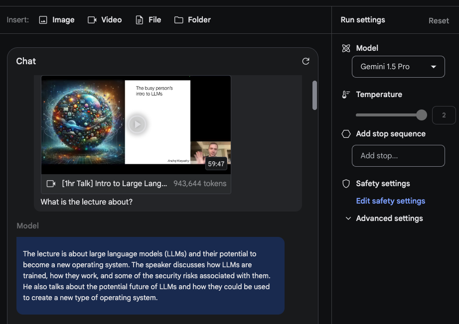
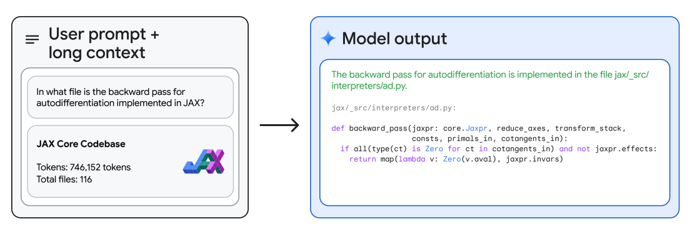
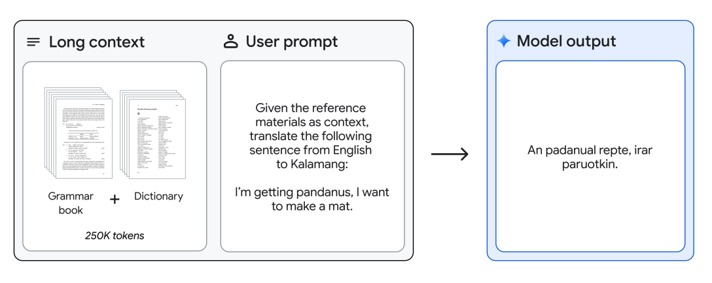

# Gemini 1.5 Pro

Google memperkenalkan Gemini 1.5 Pro, sebuah model kecerdasan buatan (AI) multimodal yang efisien dalam komputasi. Model ini fokus pada kemampuan mengingat dan bernalar atas konten panjang. Gemini 1.5 Pro dapat memahami dokumen panjang yang berisi jutaan token, termasuk video dan audio berdurasi berjam-jam. 

Bayangkan Gemini 1.5 Pro seperti seorang asisten super pintar yang bisa membaca buku tebal, menonton film panjang, atau mendengarkan rekaman audio berjam-jam, lalu menjawab pertanyaan tentang isinya dengan sangat akurat. Ini adalah kemajuan besar dibandingkan model AI sebelumnya yang hanya bisa memahami teks pendek.

## Arsitektur

Gemini 1.5 Pro dibangun dengan teknologi canggih bernama "sparse mixture-of-experts" (MoE). Ini seperti memiliki tim ahli yang bekerja sama, tapi hanya ahli yang diperlukan yang aktif pada saat tertentu. Hasilnya, model ini lebih efisien dan bisa memahami konteks yang sangat panjang (hingga 10 juta token).

Model ini dilatih dengan berbagai jenis data (teks, gambar, suara) dan dioptimalkan berdasarkan preferensi manusia. Bayangkan seperti melatih asisten virtual dengan berbagai pengetahuan dan mengajarinya untuk berkomunikasi seperti manusia.

## Hasil

Gemini 1.5 Pro menunjukkan kemampuan luar biasa dalam mengingat informasi penting dari:

- Rekaman audio sekitar 22 jam
- 10 buku setebal 1440 halaman
- Seluruh kode sumber program
- Video 3 jam (1 frame per detik)

Ini seperti memiliki asisten yang bisa mengingat detail dari film berdurasi 3 jam atau isi 10 buku tebal sekaligus!

Gemini 1.5 Pro juga mengungguli model-model sebelumnya dalam berbagai tes, terutama di bidang Matematika, Sains, Penalaran, Kemampuan Multibahasa, Pemahaman Video, dan Pemrograman.

## Kemampuan

### Analisis Dokumen Panjang

Gemini 1.5 Pro bisa membaca dan memahami dokumen PDF yang sangat panjang. Contohnya, kita bisa mengunggah satu atau beberapa PDF dan bertanya tentang isinya.

Kita bisa bertanya berbagai hal tentang isi dokumen, seperti meminta ringkasan atau mencari informasi spesifik.

### Pemahaman Video

Gemini 1.5 Pro juga bisa memahami isi video. Kita bisa mengunggah video dan bertanya tentang isinya, seperti meminta ringkasan atau detail tertentu.

Model ini bisa membuat ringkasan video, menjelaskan grafik yang muncul, atau bahkan mencari informasi pada waktu tertentu dalam video.

### Penalaran Kode

Gemini 1.5 Pro mampu memahami dan menjawab pertanyaan tentang kode program yang sangat panjang. Ini sangat berguna untuk programmer yang ingin menganalisis atau memahami kode yang kompleks.

### Terjemahan Bahasa Langka

Model ini bahkan bisa mempelajari dan menerjemahkan bahasa yang sangat langka. Contohnya, setelah diberi informasi tentang bahasa Kalamang (yang hanya digunakan oleh kurang dari 200 orang di dunia), Gemini 1.5 Pro bisa menerjemahkan dari bahasa Inggris ke Kalamang.

Sumber gambar: [Gemini 1.5: Unlocking multimodal understanding across millions of tokens of context](https://storage.googleapis.com/deepmind-media/gemini/gemini_v1_5_report.pdf)

## Referensi

- [Gemini 1.5: Unlocking multimodal understanding across millions of tokens of context](https://storage.googleapis.com/deepmind-media/gemini/gemini_v1_5_report.pdf)
- [Gemini 1.5: Our next-generation model, now available for Private Preview in Google AI Studio](https://developers.googleblog.com/2024/02/gemini-15-available-for-private-preview-in-google-ai-studio.html)

