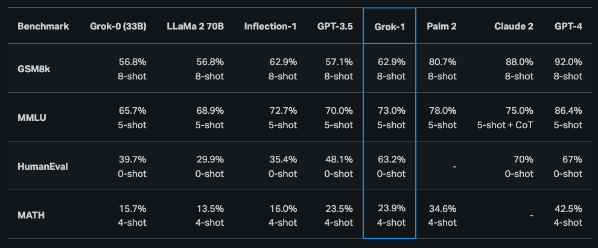
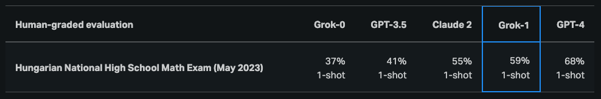

# Grok-1

Grok-1 adalah model bahasa besar (LLM) jenis mixture-of-experts (MoE) dengan 314 miliar parameter yang termasuk rilis terbuka dari bobot model dasar dan arsitektur jaringan.

Grok-1 dilatih oleh xAI dan terdiri dari model MoE yang mengaktifkan 25% dari bobot untuk token tertentu saat inferensi. Tanggal batas pelatihan awal untuk Grok-1 adalah Oktober 2023.

Seperti yang dinyatakan dalam [pengumuman resmi](https://x.ai/blog/grok-os), Grok-1 adalah checkpoint model dasar mentah dari fase pelatihan awal, yang berarti belum dioptimalkan untuk aplikasi tertentu seperti agen percakapan.

Model ini telah [dirilis](https://github.com/xai-org/grok-1) di bawah lisensi Apache 2.0.

## Hasil dan Kemampuan

Menurut [pengumuman](https://x.ai/blog/grok) awal, Grok-1 menunjukkan kemampuan yang kuat dalam tugas-tugas penalaran dan pengkodean. Hasil terakhir yang tersedia untuk umum menunjukkan bahwa Grok-1 mencapai 63,2% pada tugas pengkodean HumanEval dan 73% pada MMLU. Secara umum, Grok-1 mengungguli ChatGPT-3.5 dan Inflection-1, tetapi masih tertinggal dari model yang lebih canggih seperti GPT-4.

Grok-1 juga dilaporkan mendapat nilai C (59%) dibandingkan dengan nilai B (68%) dari GPT-4 pada ujian akhir SMA nasional Hungaria dalam matematika.

Anda dapat melihat model ini di sini: https://github.com/xai-org/grok-1

Karena ukuran Grok-1 yang besar (314 miliar parameter), xAI merekomendasikan penggunaan mesin dengan beberapa GPU untuk menguji model ini.

## Referensi

- [Rilis Terbuka Grok-1](https://x.ai/blog/grok-os)
- [Pengumuman Grok](https://x.ai/blog/grok)
