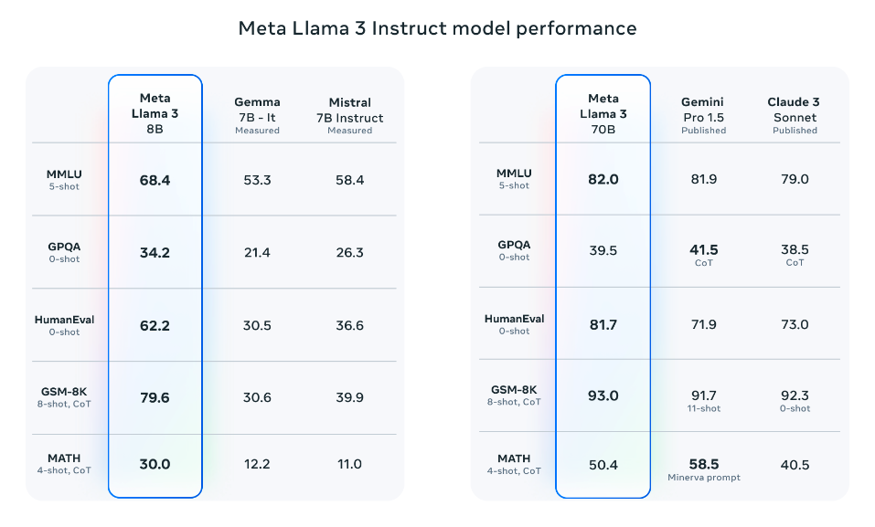
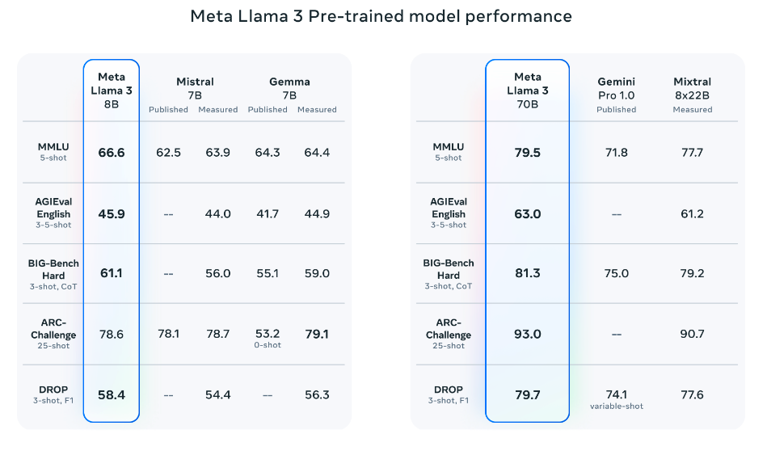
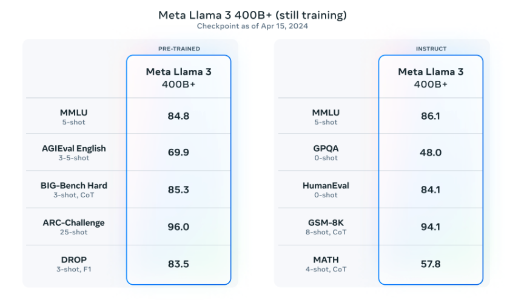

# Llama 3

import {Bleed} from 'nextra-theme-docs'

Meta baru-baru ini [memperkenalkan](https://llama.meta.com/llama3/) keluarga baru model bahasa besar (LLM) mereka yang disebut Llama 3. Rilis ini mencakup model dengan 8 miliar dan 70 miliar parameter yang telah dilatih sebelumnya dan disesuaikan dengan instruksi.

## Detail Arsitektur Llama 3

Berikut ringkasan detail teknis Llama 3 yang disebutkan:

- Menggunakan transformer decoder-only standar (model AI yang hanya menggunakan bagian decoder untuk memproses dan menghasilkan teks).
- Kosakatanya terdiri dari 128 ribu token (unit dasar teks yang diproses oleh model).
- Dilatih menggunakan urutan 8 ribu token.
- Menerapkan grouped query attention (GQA) (teknik untuk meningkatkan efisiensi pemrosesan).
- Pra-pelatihan dilakukan dengan lebih dari 15 triliun token.
- Melibatkan pelatihan lanjutan yang mencakup kombinasi SFT (Supervised Fine-Tuning), rejection sampling (teknik pemilihan sampel), PPO (Proximal Policy Optimization), dan DPO (Direct Preference Optimization).

## Kinerja

Yang menarik, Llama 3 8B (yang disesuaikan dengan instruksi) mengungguli [Gemma 7B](https://www.promptingguide.ai/models/gemma) dan [Mistral 7B Instruct](https://www.promptingguide.ai/models/mistral-7b). Llama 3 70B secara umum mengungguli [Gemini Pro 1.5](https://www.promptingguide.ai/models/gemini-pro) dan [Claude 3 Sonnet](https://www.promptingguide.ai/models/claude-3), namun sedikit tertinggal dalam benchmark MATH jika dibandingkan dengan Gemini Pro 1.5.

*Sumber: [Meta AI](https://ai.meta.com/blog/meta-llama-3/)*

Model yang telah dilatih sebelumnya juga mengungguli model lain dalam beberapa benchmark seperti AGIEval (Bahasa Inggris), MMLU, dan Big-Bench Hard.

*Sumber: [Meta AI](https://ai.meta.com/blog/meta-llama-3/)*

## Llama 3 400B

Meta juga melaporkan bahwa mereka akan merilis model dengan 400 miliar parameter yang masih dalam tahap pelatihan dan akan segera hadir! Ada juga upaya untuk mendukung kemampuan multimodal (memproses berbagai jenis data seperti teks dan gambar), kemampuan multibahasa, dan jendela konteks yang lebih panjang dalam pengembangan. Checkpoint terkini untuk Llama 3 400B (per 15 April 2024) menghasilkan hasil berikut pada benchmark umum seperti MMLU dan Big-Bench Hard:

*Sumber: [Meta AI](https://ai.meta.com/blog/meta-llama-3/)*

Informasi lisensi untuk model-model Llama 3 dapat ditemukan di [kartu model](https://github.com/meta-llama/llama3/blob/main/MODEL_CARD.md).

## Ulasan Lengkap Llama 3

Berikut adalah ulasan lebih panjang tentang Llama 3:

<iframe width="100%"
  height="415px"
  src="https://www.youtube.com/embed/h2aEmciRd6U?si=m7-xXu5IWpB-6mE0" allow="accelerometer; autoplay; clipboard-write; encrypted-media; gyroscope; picture-in-picture"
  allowFullScreen
  />

