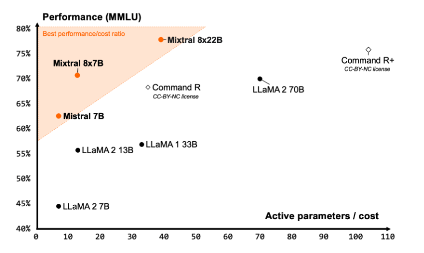
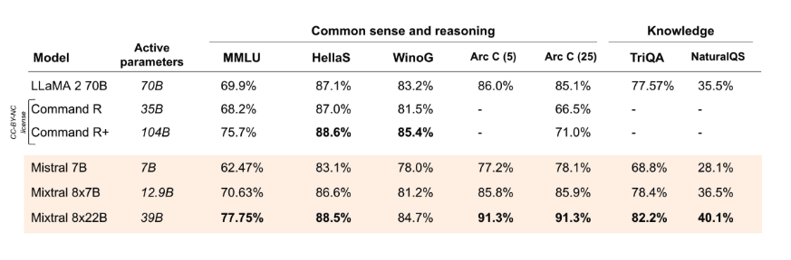
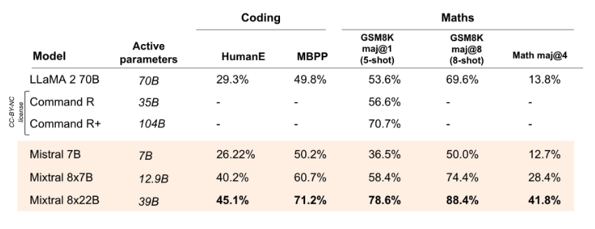

# Mixtral 8x22B

Mixtral 8x22B adalah model bahasa besar (Large Language Model atau LLM) terbuka baru yang dirilis oleh Mistral AI. Mixtral 8x22B dikenal sebagai model campuran ahli yang jarang (sparse mixture-of-experts) dengan 39 miliar parameter aktif dari total 141 miliar parameter.

## Kemampuan

Mixtral 8x22B dilatih untuk menjadi model yang hemat biaya dengan kemampuan yang meliputi:
- Pemahaman multibahasa (bisa mengerti berbagai bahasa)
- Penalaran matematika (bisa memecahkan masalah matematika)
- Pembuatan kode (bisa menulis program komputer)
- Dukungan pemanggilan fungsi asli (bisa berinteraksi dengan fungsi-fungsi tertentu)
- Dukungan keluaran terbatas (bisa menghasilkan output dengan batasan tertentu)

Model ini mendukung ukuran jendela konteks 64 ribu token, yang memungkinkan pengingatan informasi yang sangat baik pada dokumen-dokumen besar.

Mistral AI mengklaim bahwa Mixtral 8x22B memberikan salah satu rasio kinerja-biaya terbaik untuk model komunitas dan sangat cepat karena aktivasinya yang jarang.

*Sumber: [Blog Mistral AI](https://mistral.ai/news/mixtral-8x22b/)*

## Hasil

Menurut [hasil resmi yang dilaporkan](https://mistral.ai/news/mixtral-8x22b/), Mixtral 8x22B (dengan 39 miliar parameter aktif) mengungguli model-model terbuka terkemuka seperti Command R+ dan Llama 2 70B dalam beberapa tolok ukur penalaran dan pengetahuan seperti MMLU, HellaS, TriQA, NaturalQA, dan lainnya.

*Sumber: [Blog Mistral AI](https://mistral.ai/news/mixtral-8x22b/)*

Mixtral 8x22B mengungguli semua model terbuka dalam tugas-tugas pemrograman dan matematika ketika dievaluasi pada tolok ukur seperti GSM8K, HumanEval, dan Math. Dilaporkan bahwa Mixtral 8x22B Instruct mencapai skor 90% pada GSM8K (maj@8).

*Sumber: [Blog Mistral AI](https://mistral.ai/news/mixtral-8x22b/)*

Informasi lebih lanjut tentang Mixtral 8x22B dan cara menggunakannya dapat ditemukan di sini: https://docs.mistral.ai/getting-started/open_weight_models/#operation/listModels

Model ini dirilis di bawah lisensi Apache 2.0, yang berarti dapat digunakan secara bebas dengan beberapa syarat tertentu.

