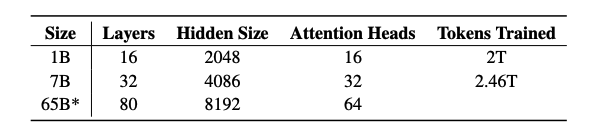
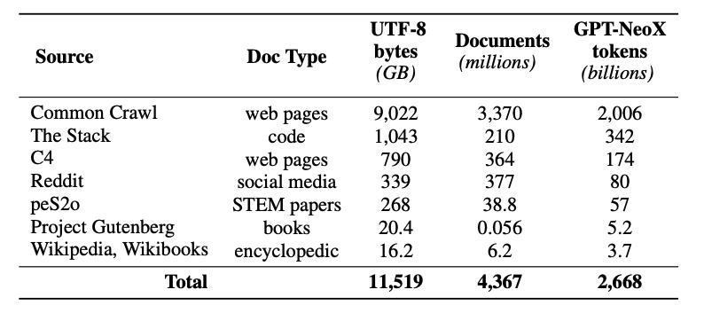
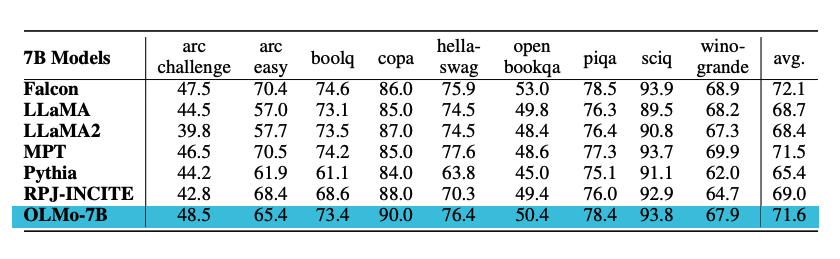

# OLMo

Dalam panduan ini, kami memberikan gambaran umum tentang Open Language Model (OLMo), termasuk contoh prompt dan penggunaannya. Panduan ini juga mencakup tips, aplikasi, batasan, makalah, dan bahan bacaan tambahan terkait OLMo.

## Pengenalan OLMo

Allen Institute of AI telah [merilis](https://blog.allenai.org/olmo-open-language-model-87ccfc95f580) model bahasa terbuka dan kerangka kerja baru yang disebut OLMo. Upaya ini bertujuan untuk memberikan akses penuh ke data, kode pelatihan, model, dan kode evaluasi untuk mempercepat studi model bahasa secara kolektif.

Rilis pertama mereka mencakup empat varian dengan skala parameter 7 miliar (7B) dan satu model dengan skala 1 miliar (1B), yang semuanya dilatih pada setidaknya 2 triliun token. Ini menandai yang pertama dari banyak rilis yang juga termasuk model OLMo 65B yang akan datang.

Rilis ini mencakup:

- Data pelatihan lengkap, termasuk [kode](https://github.com/allenai/dolma) yang menghasilkan data tersebut
- Bobot model lengkap, [kode pelatihan](https://github.com/allenai/OLMo), log, metrik, dan kode inferensi
- Beberapa checkpoint untuk setiap model
- [Kode evaluasi](https://github.com/allenai/OLMo-Eval)
- Kode fine-tuning (penyetelan halus)

Semua kode, bobot, dan checkpoint perantara dirilis di bawah [Lisensi Apache 2.0](https://github.com/allenai/OLMo#Apache-2.0-1-ov-file).

## OLMo-7B

Baik model OLMo-7B maupun OLMo-1B mengadopsi arsitektur transformer decoder-only. Model ini mengikuti perbaikan dari model lain seperti PaLM dan Llama:

- Tanpa bias
- Layer normalization non-parametrik
- Fungsi aktivasi SwiGLU
- Rotary positional embeddings (RoPE)
- Kosakata sebanyak 50.280

## Dataset Dolma

Rilis ini juga mencakup dataset pra-pelatihan yang disebut [Dolma](https://github.com/allenai/dolma) -- sebuah korpus multi-sumber yang beragam dengan 3 triliun token di seluruh 5 miliar dokumen yang diperoleh dari 7 sumber data berbeda. Pembuatan Dolma melibatkan langkah-langkah seperti penyaringan bahasa, penyaringan kualitas, penyaringan konten, penghapusan duplikat, pencampuran multi-sumber, dan tokenisasi.

Dataset pelatihan mencakup sampel 2 triliun token dari Dolma. Token-token tersebut digabungkan setelah menambahkan token khusus `EOS` di akhir setiap dokumen. Contoh pelatihan mencakup kelompok potongan berurutan sebanyak 2048 token, yang juga diacak.

Detail pelatihan lebih lanjut dan spesifikasi perangkat keras untuk melatih model dapat ditemukan dalam makalah.

## Hasil

Model-model ini dievaluasi pada tugas-tugas hilir menggunakan [Catwalk](https://github.com/allenai/catwalk). Model OLMo dibandingkan dengan beberapa model lain yang tersedia untuk umum seperti Falcon dan Llama 2. Secara khusus, model dievaluasi pada serangkaian tugas yang bertujuan untuk mengukur kemampuan penalaran akal sehat model. Suite evaluasi hilir mencakup dataset seperti `piqa` dan `hellaswag`. Penulis melakukan evaluasi zero-shot menggunakan klasifikasi peringkat (yaitu, kelengkapan diurutkan berdasarkan kemungkinan) dan akurasi dilaporkan. OLMo-7B mengungguli semua model lain pada 2 tugas akhir dan tetap berada di 3 besar pada 8 dari 9 tugas akhir. Lihat ringkasan hasil dalam grafik di bawah ini.

## Panduan Prompting untuk OLMo

Segera hadir...

---

Sumber gambar: [OLMo: Accelerating the Science of Language Models](https://allenai.org/olmo/olmo-paper.pdf)

## Referensi

- [OLMo: Open Language Model](https://blog.allenai.org/olmo-open-language-model-87ccfc95f580)
- [OLMo: Accelerating the Science of Language Models](https://allenai.org/olmo/olmo-paper.pdf)
