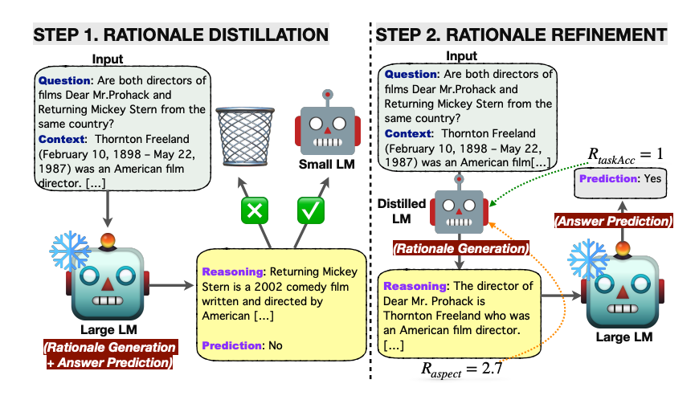

# Rantai Pemikiran yang Dipandu LM (LM-Guided Chain-of-Thought)

import {Bleed} from 'nextra-theme-docs'

<iframe width="100%"
  height="415px"
  src="https://www.youtube.com/embed/O3bl0qURONM?si=Hwdc_o0qHpw8QRsY" allow="accelerometer; autoplay; clipboard-write; encrypted-media; gyroscope; picture-in-picture"
  allowFullScreen
  />

Sebuah penelitian baru oleh [Lee et al. (2024)](https://arxiv.org/abs/2404.03414) mengusulkan cara untuk meningkatkan kemampuan penalaran pada Model Bahasa Besar (Large Language Models atau LLMs) dengan menggunakan model bahasa yang lebih kecil.

Pertama-tama, penelitian ini menerapkan teknik "penyulingan pengetahuan" (knowledge distillation) pada model bahasa kecil. Caranya dengan menggunakan alasan-alasan yang dihasilkan oleh model bahasa besar, dengan harapan dapat memperkecil perbedaan kemampuan penalaran antara keduanya.

Intinya, alasan-alasan dihasilkan oleh model bahasa ringan (kecil), sedangkan prediksi jawaban diserahkan kepada model bahasa besar yang tidak diubah. Pendekatan yang hemat sumber daya ini menghindari kebutuhan untuk melatih ulang model besar dan sebagai gantinya menyerahkan tugas menghasilkan alasan kepada model bahasa kecil.

Model bahasa yang telah "disuling" pengetahuannya kemudian dioptimalkan lebih lanjut menggunakan pembelajaran penguatan (reinforcement learning). Proses ini menggunakan beberapa sinyal penghargaan yang berorientasi pada alasan dan tugas.

*Sumber: https://arxiv.org/pdf/2404.03414.pdf*

Kerangka kerja ini diuji pada tugas menjawab pertanyaan ekstraktif multi-langkah dan mengungguli semua metode dasar dalam hal akurasi prediksi jawaban. Pembelajaran penguatan membantu meningkatkan kualitas alasan yang dihasilkan, yang selanjutnya meningkatkan kinerja dalam menjawab pertanyaan.

Pendekatan "prompting" Rantai Pemikiran yang Dipandu LM (LM-Guided Chain-of-Thought) yang diusulkan dalam penelitian ini mengungguli baik "prompting" standar maupun "prompting" Rantai Pemikiran biasa. Teknik decoding konsistensi-diri (self-consistency decoding) juga meningkatkan kinerja.

Pendekatan ini menunjukkan penggunaan cerdas model bahasa kecil untuk menghasilkan alasan. Hasilnya luar biasa mengingat model bahasa yang lebih besar biasanya lebih disukai untuk kemampuan ini dibandingkan yang lebih kecil. Menguraikan tugas dengan cara seperti ini adalah sesuatu yang harus dipikirkan secara mendalam oleh para pengembang. Tidak semua hal perlu dilakukan oleh model besar. Saat melakukan fine-tuning (penyesuaian), penting untuk memikirkan aspek apa yang ingin dioptimalkan dan menguji apakah model bahasa kecil dapat melakukannya untuk Anda.

