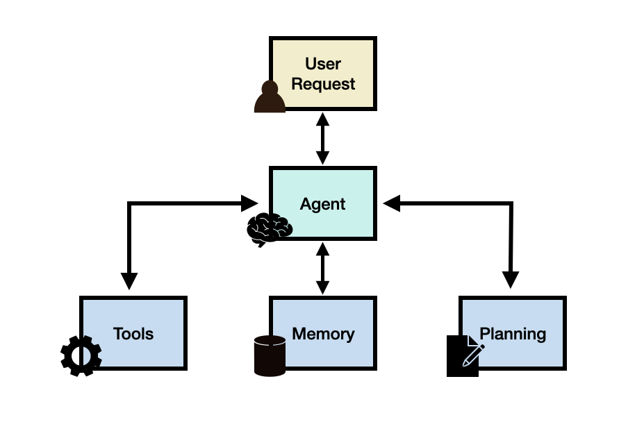

# Agen LLM (Large Language Model)

import {FilesIcon} from 'components/icons'

Agen berbasis LLM, yang selanjutnya juga disebut agen LLM, adalah aplikasi LLM yang dapat menjalankan tugas-tugas kompleks menggunakan arsitektur yang menggabungkan LLM dengan modul-modul penting seperti perencanaan dan memori. Bayangkan agen LLM sebagai asisten pintar yang memiliki "otak" berupa LLM, yang mengontrol serangkaian operasi untuk menyelesaikan tugas atau permintaan pengguna.

Untuk lebih memahami kegunaan agen LLM, mari kita bayangkan kita ingin membangun sistem yang dapat menjawab pertanyaan berikut:

> Berapa rata-rata asupan kalori harian untuk tahun 2023 di Amerika Serikat?

Pertanyaan di atas mungkin bisa dijawab oleh LLM yang sudah memiliki pengetahuan yang diperlukan. Jika LLM tidak memiliki pengetahuan yang relevan, kita bisa menggunakan sistem RAG (Retrieval-Augmented Generation) sederhana di mana LLM memiliki akses ke informasi atau laporan kesehatan terkait.

Sekarang, mari kita berikan sistem pertanyaan yang lebih kompleks:

> Bagaimana tren rata-rata asupan kalori harian di kalangan orang dewasa berubah selama dekade terakhir di Amerika Serikat, dan apa dampak yang mungkin terjadi pada tingkat obesitas? Selain itu, bisakah Anda memberikan representasi grafis dari tren tingkat obesitas selama periode ini?

Untuk menjawab pertanyaan seperti ini, menggunakan LLM saja tidak cukup. Bahkan menggabungkan LLM dengan basis pengetahuan eksternal (sistem RAG) mungkin masih belum cukup. Ini karena pertanyaan kompleks di atas membutuhkan LLM untuk memecah tugas menjadi beberapa bagian yang dapat diselesaikan menggunakan alat-alat dan serangkaian operasi yang mengarah pada respons akhir yang diinginkan.

Solusi yang mungkin adalah membangun agen LLM yang memiliki akses ke:
1. API pencarian
2. Publikasi terkait kesehatan
3. Database kesehatan publik/pribadi
4. Alat "penerjemah kode" yang membantu mengambil data relevan untuk membuat grafik yang berguna dalam memahami tren obesitas

Ini hanyalah komponen tingkat tinggi dari agen LLM hipotetis, tetapi masih ada pertimbangan penting lainnya seperti membuat rencana untuk mengatasi tugas dan potensi akses ke modul memori yang membantu agen melacak alur operasi, pengamatan, dan kemajuan secara keseluruhan.

## Kerangka Kerja Agen LLM

Secara umum, kerangka kerja agen LLM dapat terdiri dari komponen-komponen inti berikut:

- Permintaan Pengguna - pertanyaan atau permintaan dari pengguna
- Agen/Otak - inti agen yang bertindak sebagai koordinator
- Perencanaan - membantu agen dalam merencanakan tindakan masa depan
- Memori - mengelola perilaku masa lalu agen

### Agen

LLM dengan kemampuan serba guna berfungsi sebagai otak utama atau koordinator sistem. Komponen ini akan diaktifkan menggunakan template prompt yang berisi detail penting tentang bagaimana agen akan beroperasi dan alat-alat yang akan diaksesnya.

Meskipun tidak wajib, agen dapat diberi profil atau persona untuk menentukan perannya. Informasi profil ini biasanya ditulis dalam prompt yang dapat mencakup detail spesifik seperti rincian peran, kepribadian, informasi sosial, dan informasi demografis lainnya.

### Perencanaan

#### Perencanaan Tanpa Umpan Balik

Modul perencanaan membantu memecah langkah-langkah atau subtugas yang diperlukan yang akan diselesaikan agen secara individual untuk menjawab permintaan pengguna. Langkah ini penting untuk memungkinkan agen bernalar lebih baik tentang masalah dan menemukan solusi yang andal.

Teknik populer untuk dekomposisi tugas meliputi:
- Chain of Thought (Rantai Pemikiran): metode penalaran langkah demi langkah
- Tree of Thoughts (Pohon Pemikiran): metode penalaran dengan beberapa jalur alternatif

#### Perencanaan Dengan Umpan Balik

Untuk mengatasi tantangan perencanaan jangka panjang dalam tugas-tugas kompleks, kita dapat menggunakan mekanisme yang memungkinkan model untuk secara iteratif merefleksikan dan menyempurnakan rencana eksekusi berdasarkan tindakan dan pengamatan masa lalu. Tujuannya adalah untuk memperbaiki dan meningkatkan kesalahan masa lalu yang membantu meningkatkan kualitas hasil akhir.

Dua metode populer untuk mekanisme refleksi atau kritik ini meliputi:
- ReAct: menggabungkan penalaran dan tindakan
- Reflexion: mekanisme refleksi diri untuk memperbaiki kesalahan

### Memori

Modul memori membantu menyimpan log internal agen termasuk pemikiran, tindakan, dan pengamatan masa lalu dari lingkungan, termasuk semua interaksi antara agen dan pengguna. Ada dua jenis memori utama:

- **Memori jangka pendek**: mencakup informasi konteks tentang situasi agen saat ini
- **Memori jangka panjang**: mencakup perilaku dan pemikiran masa lalu agen yang perlu disimpan dan diingat dalam jangka waktu yang lama

Memori hibrid menggabungkan kedua jenis memori untuk meningkatkan kemampuan agen dalam penalaran jangka panjang dan akumulasi pengalaman.

### Alat

Alat adalah seperangkat fungsi yang memungkinkan agen LLM berinteraksi dengan lingkungan eksternal seperti API Pencarian Wikipedia, Penerjemah Kode, dan Mesin Matematika. Alat juga bisa termasuk database, basis pengetahuan, dan model eksternal.

Alat dimanfaatkan dengan cara berbeda oleh LLM:
- MRKL: kerangka kerja yang menggabungkan LLM dengan modul ahli
- Toolformer: melatih LLM untuk menggunakan API alat eksternal
- Function Calling: menambahkan kemampuan penggunaan alat pada LLM
- HuggingGPT: agen yang menggunakan LLM sebagai perencana tugas untuk menghubungkan berbagai model AI yang ada

## Aplikasi Agen LLM

Agen berbasis LLM telah diterapkan secara efektif di berbagai domain karena kemampuan penalaran kompleks dan pemahaman akal sehat mereka. Beberapa contoh aplikasi meliputi:

- Dukungan kesehatan mental
- Simulasi perilaku ekonomi manusia
- Simulasi kehidupan sehari-hari manusia dalam kota virtual
- Simulasi proses pengambilan keputusan hakim
- Asisten penelitian untuk tugas-tugas seperti menghasilkan abstrak dan mengekstrak kata kunci
- Agen kimia untuk merencanakan dan melaksanakan sintesis senyawa
- Otomatisasi desain, perencanaan, dan pelaksanaan eksperimen ilmiah
- Agen matematika untuk membantu peneliti dalam mengeksplorasi, menemukan, memecahkan, dan membuktikan masalah matematika
- Asisten untuk arsitek dalam membangun struktur di lingkungan simulasi 3D
- Otomatisasi tugas-tugas rekayasa perangkat lunak seperti pengkodean, debugging, dan pengujian
- Administrator database berbasis LLM yang memberikan saran diagnosis dan optimisasi untuk database
- Aplikasi LLM untuk mengatasi tantangan di industri minyak dan gas
- Sistem agen terpadu untuk penalaran dan perencanaan tugas yang diwujudkan

### Alat Agen LLM

Beberapa contoh alat dan kerangka kerja yang digunakan untuk membangun agen LLM:

- LangChain: kerangka kerja untuk mengembangkan aplikasi dan agen yang didukung oleh model bahasa
- AutoGPT: menyediakan alat untuk membangun agen AI
- Langroid: menyederhanakan pembangunan aplikasi LLM dengan Pemrograman Multi-Agen
- AutoGen: kerangka kerja yang memungkinkan pengembangan aplikasi LLM menggunakan beberapa agen yang dapat berkomunikasi satu sama lain untuk menyelesaikan tugas
- OpenAgents: platform terbuka untuk menggunakan dan menghosting agen bahasa
- LlamaIndex: kerangka kerja untuk menghubungkan sumber data kustom ke model bahasa besar
- GPT Engineer: mengotomatisasi generasi kode untuk menyelesaikan tugas pengembangan
- DemoGPT: agen AI otonom untuk membuat aplikasi Streamlit interaktif
- GPT Researcher: agen otonom yang dirancang untuk penelitian online komprehensif tentang berbagai tugas
- AgentVerse: dirancang untuk memfasilitasi penyebaran beberapa agen berbasis LLM dalam berbagai aplikasi
- Agents: perpustakaan/kerangka kerja sumber terbuka untuk membangun agen bahasa otonom
- BMTools: memperluas model bahasa menggunakan alat dan berfungsi sebagai platform bagi komunitas untuk membangun dan berbagi alat
- crewAI: kerangka kerja agen AI yang dirancang ulang untuk insinyur, menawarkan kemampuan yang kuat dengan kesederhanaan untuk membangun agen dan otomatisasi
- Phidata: toolkit untuk membangun Asisten AI menggunakan pemanggilan fungsi

## Evaluasi Agen LLM

Mengevaluasi agen LLM adalah tugas yang menantang. Metode evaluasi umum meliputi:

- **Anotasi Manusia**: Melibatkan evaluator manusia yang secara langsung menilai hasil LLM di berbagai aspek
- **Tes Turing**: Evaluator manusia diminta untuk membandingkan hasil dari manusia nyata dan agen
- **Metrik**: Metrik yang dirancang dengan hati-hati yang mencerminkan kualitas agen
- **Protokol**: Protokol evaluasi umum yang menentukan bagaimana metrik digunakan
- **Benchmark**: Beberapa benchmark telah dirancang untuk mengevaluasi agen LLM

## Tantangan

Agen LLM masih dalam tahap awal, sehingga masih banyak tantangan dan keterbatasan yang tersisa saat membangunnya:

- Kemampuan bermain peran
- Perencanaan jangka panjang dan panjang konteks yang terbatas
- Penyelarasan manusia yang umum
- Kekokohan dan keandalan prompt
- Batas pengetahuan
- Efisiensi

## Referensi

(Daftar referensi tetap dalam bahasa Inggris untuk memudahkan pencarian)

