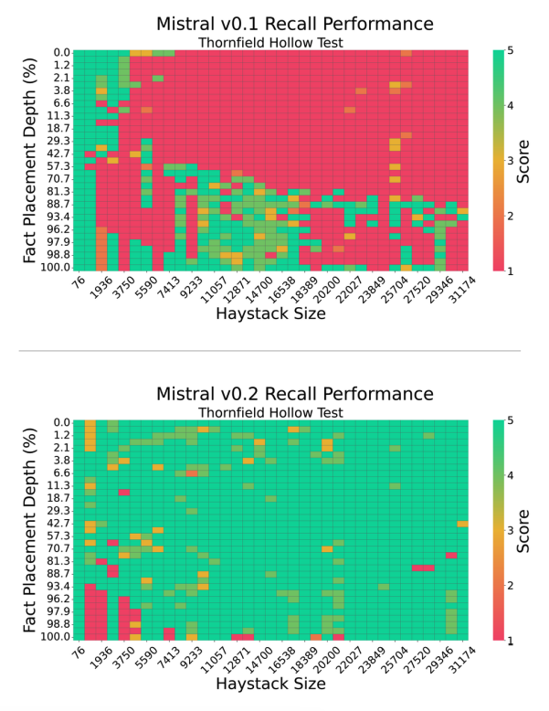

# Kemampuan Mengingat Konteks LLM Bergantung pada Prompt

import {Bleed} from 'nextra-theme-docs'

<iframe width="100%"
  height="415px"
  src="https://www.youtube.com/embed/2cNO76lIZ4s?si=tbbdo-vnr56YQ077" allow="accelerometer; autoplay; clipboard-write; encrypted-media; gyroscope; picture-in-picture"
  allowFullScreen
  />

[Penelitian terbaru oleh Machlab dan Battle (2024)](https://arxiv.org/abs/2404.08865) menganalisis kemampuan berbagai LLM (Large Language Models atau Model Bahasa Besar) dalam mengingat informasi dari konteks yang diberikan. Mereka menggunakan beberapa tes "jarum dalam jerami" untuk menguji hal ini.

Hasil penelitian menunjukkan bahwa LLM yang berbeda memiliki kemampuan mengingat fakta yang berbeda-beda, tergantung pada panjang dan kedalaman penempatan informasi. Yang menarik, performa mengingat sebuah model sangat dipengaruhi oleh perubahan kecil dalam prompt (petunjuk atau instruksi yang diberikan kepada model).

*Sumber: [Machlab dan Battle (2024)](https://arxiv.org/abs/2404.08865)*

Selain itu, interaksi antara isi prompt dan data pelatihan dapat menurunkan kualitas respons model. Bayangkan seperti memberikan petunjuk yang membingungkan kepada seseorang yang sedang belajar.

Kabar baiknya, kemampuan mengingat sebuah model dapat ditingkatkan dengan beberapa cara:
1. Memperbesar ukuran model (seperti menambah kapasitas otak)
2. Meningkatkan mekanisme perhatian (membuat model lebih fokus)
3. Mencoba strategi pelatihan yang berbeda (seperti metode belajar yang bervariasi)
4. Menerapkan fine-tuning (penyesuaian khusus untuk tugas tertentu)

Tips penting dari penelitian ini: "Evaluasi yang berkelanjutan akan membantu dalam memilih LLM yang tepat untuk kasus penggunaan tertentu, memaksimalkan dampak dan efisiensi mereka dalam aplikasi dunia nyata seiring berkembangnya teknologi."

Pelajaran penting dari penelitian ini adalah:
1. Pentingnya merancang prompt dengan hati-hati
2. Membuat protokol evaluasi yang berkelanjutan
3. Menguji berbagai strategi peningkatan model untuk memperbaiki kemampuan mengingat dan kegunaannya

Dengan memahami hal-hal ini, kita bisa menggunakan LLM dengan lebih efektif dan mendapatkan hasil yang lebih baik dalam berbagai aplikasi.

