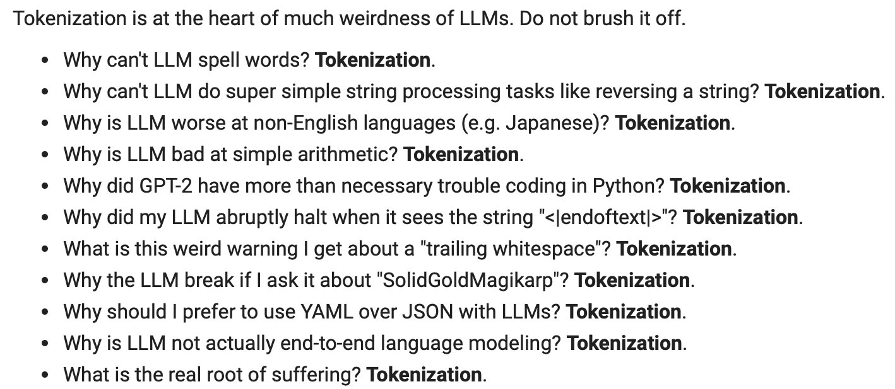

# Tokenisasi LLM

Andrej Karpathy baru-baru ini menerbitkan [kuliah](https://youtu.be/zduSFxRajkE?si=Hq_93DBE72SQt73V) baru tentang tokenisasi model bahasa besar (LLM). Tokenisasi adalah bagian penting dalam pelatihan LLM, tetapi prosesnya melibatkan pelatihan tokenizer menggunakan dataset dan algoritma mereka sendiri (misalnya, [Byte Pair Encoding](https://en.wikipedia.org/wiki/Byte_pair_encoding) atau Pengkodean Pasangan Byte).

Dalam kuliah tersebut, Karpathy mengajarkan cara membuat tokenizer GPT dari awal. Dia juga membahas perilaku aneh yang berasal dari tokenisasi.

*Sumber Gambar: https://youtu.be/zduSFxRajkE?t=6711*

Berikut adalah versi teks dari daftar di atas:

- Mengapa LLM tidak bisa mengeja kata dengan benar? Tokenisasi.
- Mengapa LLM tidak bisa melakukan tugas pemrosesan string sederhana seperti membalikkan string? Tokenisasi.
- Mengapa LLM lebih buruk dalam bahasa selain Inggris (misalnya Jepang)? Tokenisasi.
- Mengapa LLM buruk dalam aritmatika sederhana? Tokenisasi.
- Mengapa GPT-2 mengalami kesulitan yang tidak perlu saat menulis kode Python? Tokenisasi.
- Mengapa LLM saya tiba-tiba berhenti ketika melihat string "\<endoftext\>"? Tokenisasi.
- Apa peringatan aneh yang saya dapatkan tentang "trailing whitespace" (spasi di akhir)? Tokenisasi.
- Mengapa LLM rusak jika saya bertanya tentang "SolidGoldMagikarp"? Tokenisasi.
- Mengapa saya sebaiknya menggunakan YAML daripada JSON dengan LLM? Tokenisasi.
- Mengapa LLM sebenarnya bukan pemodelan bahasa end-to-end? Tokenisasi.
- Apa akar sejati dari penderitaan? Tokenisasi.

Untuk meningkatkan keandalan LLM, penting untuk memahami cara memberikan prompt (petunjuk) kepada model-model ini, yang juga melibatkan pemahaman tentang keterbatasan mereka. Meskipun tidak terlalu banyak penekanan pada tokenizer (selain konfigurasi `max_tokens`) pada saat inferensi, rekayasa prompt yang baik melibatkan pemahaman tentang batasan dan keterbatasan yang melekat dalam tokenisasi, mirip dengan cara menyusun atau memformat prompt Anda.

Anda mungkin menghadapi skenario di mana prompt Anda berkinerja buruk karena gagal memahami singkatan atau konsep yang tidak diproses atau ditokenisasi dengan benar. Ini adalah masalah umum yang sering diabaikan oleh banyak pengembang dan peneliti LLM.

Alat yang baik untuk tokenisasi adalah [Tiktokenizer](https://tiktokenizer.vercel.app/), dan ini sebenarnya digunakan dalam kuliah untuk tujuan demonstrasi.

