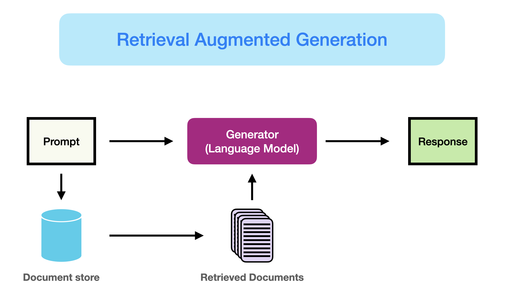
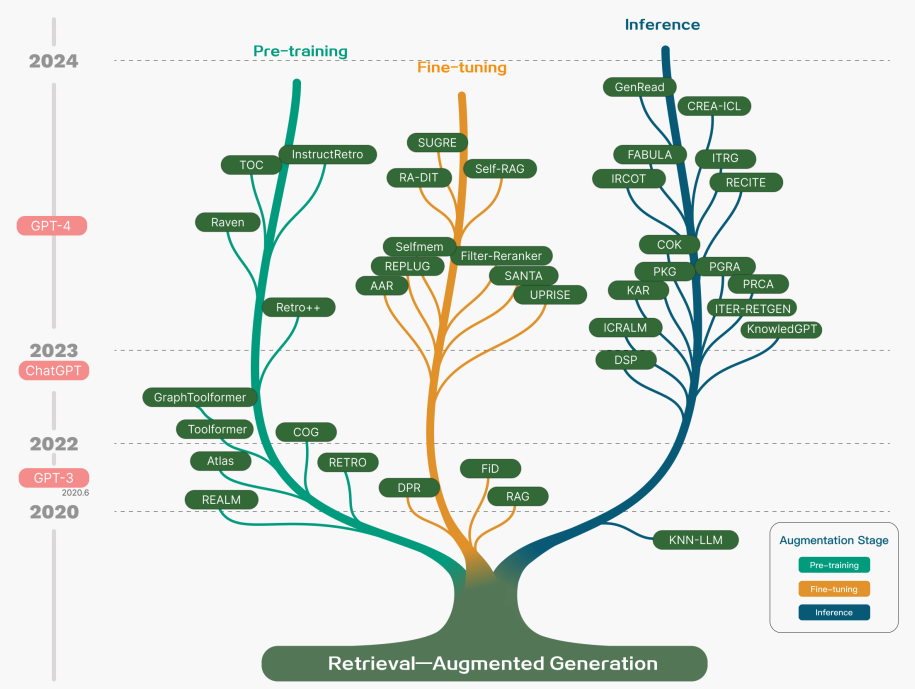
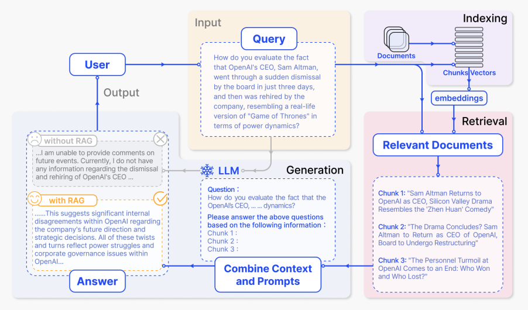
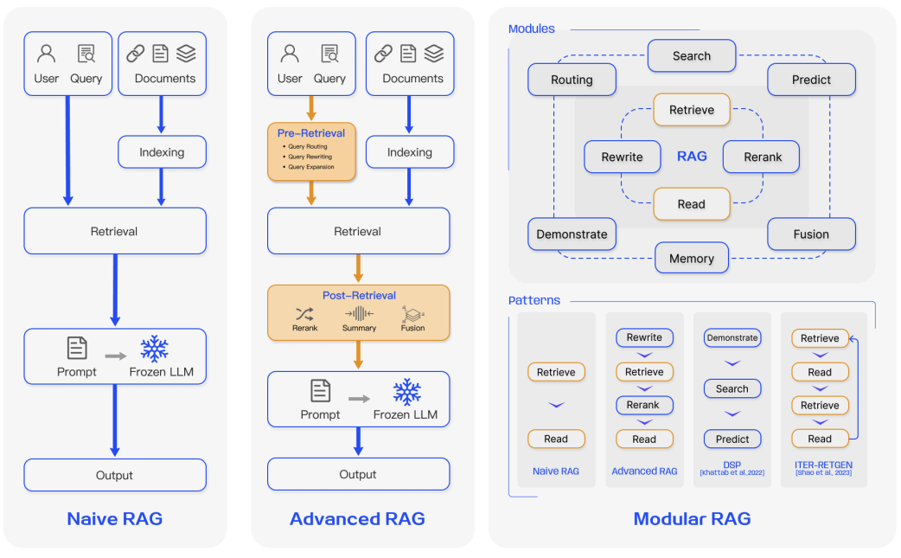
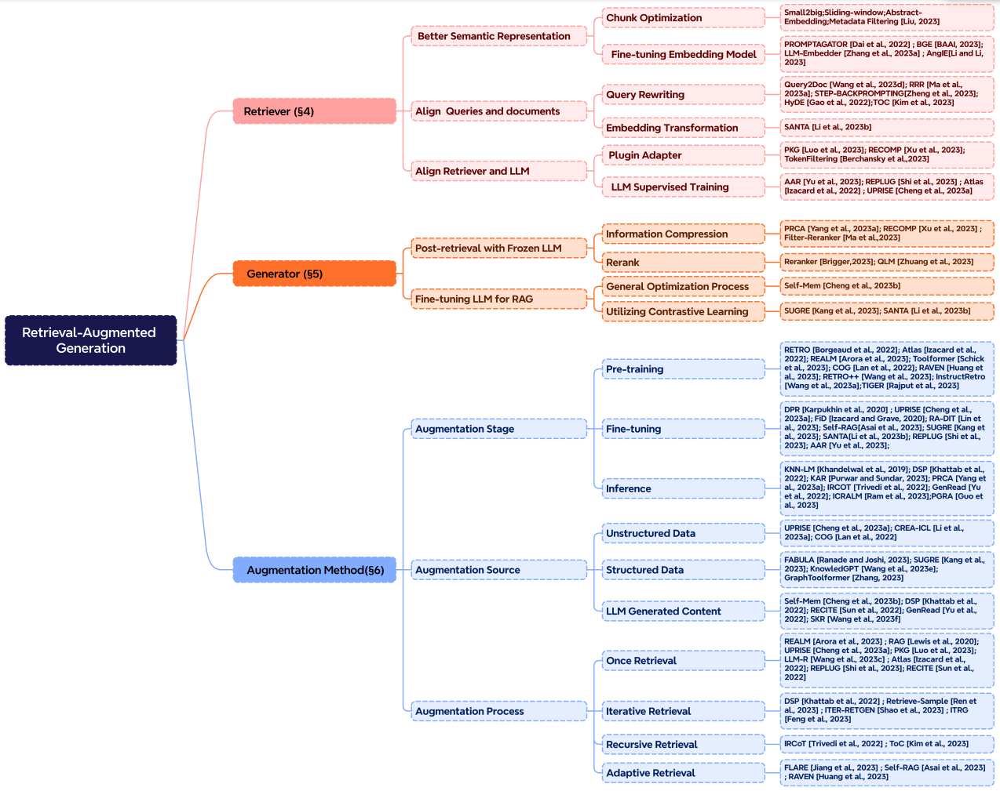
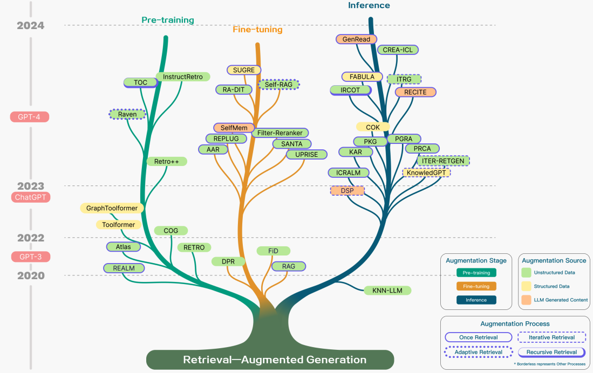
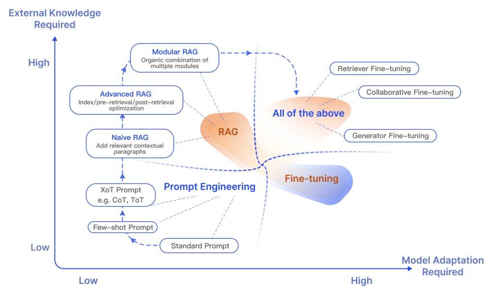
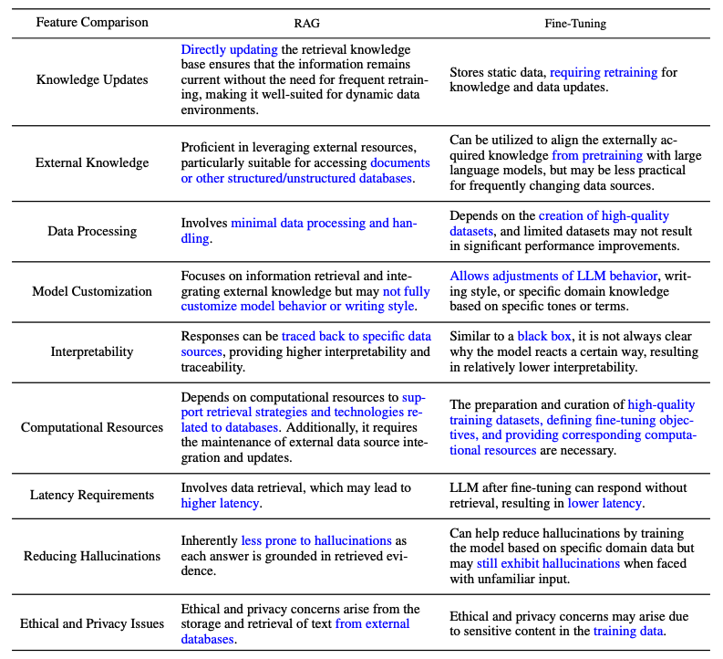
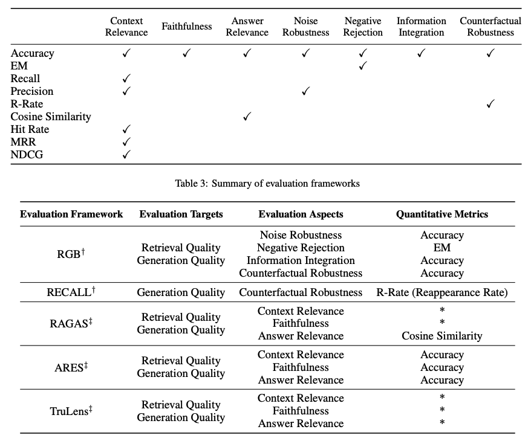
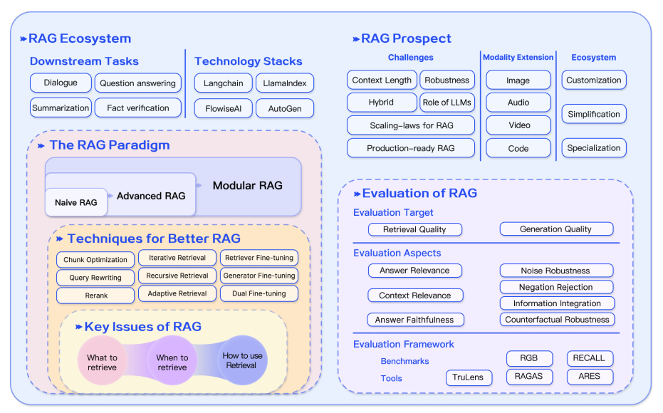

# Retrieval Augmented Generation (RAG) untuk LLM

import { Callout } from 'nextra/components'

Ada banyak tantangan saat bekerja dengan LLM (Large Language Models atau Model Bahasa Besar) seperti kesenjangan pengetahuan domain, masalah faktualitas, dan halusinasi. Retrieval Augmented Generation (RAG) atau Generasi yang Ditingkatkan dengan Pengambilan menawarkan solusi untuk mengurangi beberapa masalah ini dengan menambahkan pengetahuan eksternal seperti database ke LLM. RAG sangat berguna dalam skenario yang membutuhkan banyak pengetahuan atau aplikasi domain tertentu yang memerlukan pengetahuan yang terus diperbarui. Keuntungan utama RAG dibandingkan pendekatan lain adalah LLM tidak perlu dilatih ulang untuk aplikasi tugas tertentu. RAG telah populer belakangan ini dengan penerapannya dalam agen percakapan.

Dalam ringkasan ini, kami menyoroti temuan utama dan wawasan praktis dari survei terbaru berjudul [Retrieval-Augmented Generation for Large Language Models: A Survey](https://arxiv.org/abs/2312.10997) (Gao et al., 2023). Secara khusus, kami fokus pada pendekatan yang ada, RAG mutakhir, evaluasi, aplikasi, dan teknologi seputar berbagai komponen yang membentuk sistem RAG (teknik pengambilan, generasi, dan augmentasi).

## Pengenalan RAG

Seperti yang diperkenalkan dengan lebih baik [di sini](https://www.promptingguide.ai/techniques/rag), RAG dapat didefinisikan sebagai:

> RAG mengambil input dan mengambil serangkaian dokumen yang relevan/mendukung dari sumber tertentu (misalnya, Wikipedia). Dokumen-dokumen tersebut digabungkan sebagai konteks dengan prompt input asli dan dimasukkan ke generator teks yang menghasilkan output akhir. Ini membuat RAG adaptif untuk situasi di mana fakta dapat berubah seiring waktu. Ini sangat berguna karena pengetahuan parametrik LLM bersifat statis. RAG memungkinkan model bahasa untuk melewati pelatihan ulang, memungkinkan akses ke informasi terbaru untuk menghasilkan output yang andal melalui generasi berbasis pengambilan.

Singkatnya, bukti yang diambil dalam RAG dapat berfungsi sebagai cara untuk meningkatkan akurasi, kontrol, dan relevansi respons LLM. Inilah mengapa RAG dapat membantu mengurangi masalah halusinasi atau kinerja saat menangani masalah dalam lingkungan yang sangat berkembang.

Meskipun RAG juga melibatkan optimalisasi metode pra-pelatihan, pendekatan saat ini sebagian besar telah beralih ke menggabungkan kekuatan RAG dan model yang dioptimalkan secara kuat seperti [ChatGPT](https://www.promptingguide.ai/models/chatgpt) dan [Mixtral](https://www.promptingguide.ai/models/mixtral). Grafik di bawah ini menunjukkan evolusi penelitian terkait RAG:

*[Sumber Gambar](https://arxiv.org/abs/2312.10997)*

Berikut adalah alur kerja aplikasi RAG yang umum:

*[Sumber Gambar](https://arxiv.org/abs/2312.10997)*

Kita dapat menjelaskan langkah/komponen yang berbeda sebagai berikut:
- **Input:** Pertanyaan yang dijawab oleh sistem LLM disebut sebagai input. Jika RAG tidak digunakan, LLM langsung digunakan untuk menjawab pertanyaan.
- **Pengindeksan:** Jika RAG digunakan, maka serangkaian dokumen terkait diindeks dengan memecahnya terlebih dahulu, menghasilkan embedding dari potongan-potongan tersebut, dan mengindeksnya ke dalam penyimpanan vektor. Pada saat inferensi, query juga diubah menjadi embedding dengan cara yang sama.
- **Pengambilan:** Dokumen yang relevan diperoleh dengan membandingkan query dengan vektor yang diindeks, juga disebut sebagai "Dokumen Relevan".
- **Generasi:** Dokumen yang relevan digabungkan dengan prompt asli sebagai konteks tambahan. Teks dan prompt yang digabungkan kemudian dilewatkan ke model untuk menghasilkan respons yang kemudian disiapkan sebagai output akhir sistem kepada pengguna.

Dalam contoh yang diberikan, menggunakan model secara langsung gagal menjawab pertanyaan karena kurangnya pengetahuan tentang peristiwa terkini. Di sisi lain, ketika menggunakan RAG, sistem dapat menarik informasi yang relevan yang dibutuhkan model untuk menjawab pertanyaan dengan tepat.

<Callout type= "info" emoji="🎉">
Kami senang meluncurkan dua kursus rekayasa prompt baru. Dapatkan akses dengan bergabung dengan DAIR.AI Academy kami. [Bergabung sekarang!](https://dair-ai.thinkific.com/)

Gunakan kode PROMPTING20 untuk mendapatkan diskon tambahan 20%.

PENTING: Diskon terbatas untuk 500 siswa pertama.

</Callout>

## Paradigma RAG

Selama beberapa tahun terakhir, sistem RAG telah berkembang dari RAG Naif ke RAG Lanjutan dan RAG Modular. Evolusi ini terjadi untuk mengatasi keterbatasan tertentu seputar kinerja, biaya, dan efisiensi.

*[Sumber Gambar](https://arxiv.org/abs/2312.10997)*

### RAG Naif
RAG Naif mengikuti proses tradisional yang telah disebutkan sebelumnya yaitu pengindeksan, pengambilan, dan generasi. Singkatnya, input pengguna digunakan untuk mengambil dokumen yang relevan yang kemudian digabungkan dengan prompt dan dilewatkan ke model untuk menghasilkan respons akhir. Riwayat percakapan dapat diintegrasikan ke dalam prompt jika aplikasi melibatkan interaksi dialog multi-putaran.

RAG Naif memiliki keterbatasan seperti presisi rendah (potongan yang diambil tidak selaras) dan recall rendah (gagal mengambil semua potongan yang relevan). Juga mungkin bahwa LLM dilewatkan informasi yang sudah usang yang merupakan salah satu masalah utama yang seharusnya diatasi oleh sistem RAG pada awalnya. Ini menyebabkan masalah halusinasi dan respons yang buruk dan tidak akurat.

Ketika augmentasi diterapkan, juga bisa ada masalah dengan redundansi dan pengulangan. Ketika menggunakan beberapa bagian yang diambil, peringkat dan rekonsiliasi gaya/nada juga penting. Tantangan lain adalah memastikan bahwa tugas generasi tidak terlalu bergantung pada informasi yang ditambahkan yang dapat menyebabkan model hanya mengulang konten yang diambil.

### RAG Lanjutan

RAG Lanjutan membantu mengatasi masalah yang ada dalam RAG Naif seperti meningkatkan kualitas pengambilan yang bisa melibatkan optimalisasi proses pra-pengambilan, pengambilan, dan pasca-pengambilan.

Proses pra-pengambilan melibatkan optimalisasi pengindeksan data yang bertujuan untuk meningkatkan kualitas data yang diindeks melalui lima tahap: meningkatkan granularitas data, mengoptimalkan struktur indeks, menambahkan metadata, optimalisasi penyelarasan, dan pengambilan campuran.

Tahap pengambilan dapat ditingkatkan lebih lanjut dengan mengoptimalkan model embedding itu sendiri yang secara langsung mempengaruhi kualitas potongan yang membentuk konteks. Ini dapat dilakukan dengan menyesuaikan embedding untuk mengoptimalkan relevansi pengambilan atau menggunakan embedding dinamis yang lebih baik menangkap pemahaman kontekstual (misalnya, model embeddings-ada-02 OpenAI).

Optimalisasi pasca-pengambilan berfokus pada menghindari batas jendela konteks dan menangani informasi yang berisik atau berpotensi mengganggu. Pendekatan umum untuk mengatasi masalah ini adalah peringkat ulang yang bisa melibatkan pendekatan seperti relokasi konteks yang relevan ke tepi prompt atau menghitung ulang kesamaan semantik antara query dan potongan teks yang relevan. Kompresi prompt juga dapat membantu dalam menangani masalah ini.

### RAG Modular

Seperti namanya, RAG Modular meningkatkan modul fungsional seperti menggabungkan modul pencarian untuk pengambilan kesamaan dan menerapkan penyesuaian halus dalam pengambil. Baik RAG Naif maupun RAG Lanjutan adalah kasus khusus dari RAG Modular dan terdiri dari modul tetap. Modul RAG yang diperluas mencakup pencarian, memori, fusi, perutean, prediksi, dan adaptor tugas yang memecahkan masalah yang berbeda. Modul-modul ini dapat disusun ulang untuk menyesuaikan konteks masalah tertentu. Oleh karena itu, RAG Modular mendapat manfaat dari keragaman dan fleksibilitas yang lebih besar karena Anda dapat menambah atau mengganti modul atau menyesuaikan aliran antar modul berdasarkan kebutuhan tugas.

Mengingat peningkatan fleksibilitas dalam membangun sistem RAG, teknik optimalisasi penting lainnya telah diusulkan untuk mengoptimalkan pipeline RAG termasuk:

- **Eksplorasi Pencarian Hybrid:** Pendekatan ini memanfaatkan kombinasi teknik pencarian seperti pencarian berbasis kata kunci dan pencarian semantik untuk mengambil informasi yang relevan dan kaya konteks; ini berguna ketika menangani berbagai jenis query dan kebutuhan informasi.
- **Pengambilan Rekursif dan Mesin Query:** Melibatkan proses pengambilan rekursif yang mungkin dimulai dengan potongan semantik kecil dan kemudian mengambil potongan yang lebih besar yang memperkaya konteks; ini berguna untuk menyeimbangkan efisiensi dan informasi yang kaya konteks.
- **StepBack-prompt:** [Teknik prompting](https://arxiv.org/abs/2310.06117) yang memungkinkan LLM melakukan abstraksi yang menghasilkan konsep dan prinsip yang memandu penalaran; ini mengarah pada respons yang lebih baik ketika diadopsi ke kerangka RAG karena LLM bergerak menjauh dari contoh spesifik dan diizinkan untuk bernalar lebih luas jika diperlukan.
- **Sub-Queries:** Ada berbagai strategi query seperti query pohon atau query berurutan dari potongan yang dapat digunakan untuk skenario yang berbeda. LlamaIndex menawarkan [mesin query sub pertanyaan](https://docs.llamaindex.ai/en/latest/understanding/putting_it_all_together/agents.html#) yang memungkinkan query dipecah menjadi beberapa pertanyaan yang menggunakan sumber data relevan yang berbeda.
- **Embedding Dokumen Hipotetis:** [HyDE](https://arxiv.org/abs/2212.10496) menghasilkan jawaban hipotetis untuk query, mengubahnya menjadi embedding, dan menggunakannya untuk mengambil dokumen yang mirip dengan jawaban hipotetis alih-alih menggunakan query secara langsung.

## Kerangka RAG
Dalam bagian ini, kami meringkas perkembangan utama dari komponen sistem RAG, yang meliputi Pengambilan, Generasi, dan Augmentasi.

### Pengambilan
Pengambilan adalah komponen RAG yang menangani pengambilan konteks yang sangat relevan dari pengambil. Pengambil dapat ditingkatkan dalam banyak cara, termasuk:

**Meningkatkan Representasi Semantik**

Proses ini melibatkan peningkatan langsung representasi semantik yang mendukung pengambil. Berikut beberapa pertimbangan:

- **Chunking:** Satu langkah penting adalah memilih strategi chunking yang tepat yang bergantung pada konten yang Anda tangani dan aplikasi yang Anda hasilkan responsnya. Model yang berbeda juga menunjukkan kekuatan yang berbeda pada ukuran blok yang bervariasi. Sentence transformers akan berkinerja lebih baik pada kalimat tunggal tetapi text-embedding-ada-002 akan berkinerja lebih baik dengan blok yang berisi 256 atau 512 token. Aspek lain yang perlu dipertimbangkan termasuk panjang pertanyaan pengguna, aplikasi, dan batas token tetapi umum untuk bereksperimen dengan strategi chunking yang berbeda untuk membantu mengoptimalkan pengambilan dalam sistem RAG Anda.
- **Model Embedding yang Disesuaikan:** Setelah Anda menentukan strategi chunking yang efektif, mungkin diperlukan untuk menyesuaikan model embedding jika Anda bekerja dengan domain khusus. Jika tidak, mungkin pertanyaan pengguna akan benar-benar disalahpahami dalam aplikasi Anda. Anda dapat menyesuaikan pada pengetahuan domain yang luas (yaitu, penyesuaian pengetahuan domain) dan untuk tugas hilir tertentu. [BGE-large-EN yang dikembangkan BAAI](https://github.com/FlagOpen/FlagEmbedding) adalah model embedding yang patut diperhatikan yang dapat disesuaikan untuk mengoptimalkan relevansi pengambilan.

**Menyelaraskan Query dan Dokumen**

Proses ini menangani penyelarasan query pengguna dengan dokumen dalam ruang semantik. Ini mungkin diperlukan ketika query pengguna mungkin kurang informasi semantik atau mengandung frasa yang tidak tepat. Berikut beberapa pendekatan:

- **Penulisan Ulang Query:** Berfokus pada penulisan ulang query menggunakan berbagai teknik seperti [Query2Doc](https://arxiv.org/abs/2303.07678), [ITER-RETGEN](https://arxiv.org/abs/2305.15294), dan HyDE.
- **Transformasi Embedding:** Mengoptimalkan representasi embedding query dan menyelaraskannya ke ruang laten yang lebih dekat dengan tugas.

**Menyelaraskan Pengambil dan LLM**

Proses ini menangani penyelarasan output pengambil dengan preferensi LLM.

- **Penyesuaian Halus Pengambil:** Menggunakan sinyal umpan balik LLM untuk menyempurnakan model pengambilan. Contohnya termasuk augmentation adapted retriever ([AAR](https://arxiv.org/abs/2305.17331)), [REPLUG](https://arxiv.org/abs/2301.12652), dan [UPRISE](https://arxiv.org/abs/2303.08518), untuk menyebutkan beberapa.
- **Adaptor:** Menggabungkan adaptor eksternal untuk membantu proses penyelarasan. Contohnya termasuk [PRCA](https://aclanthology.org/2023.emnlp-main.326/), [RECOMP](https://arxiv.org/abs/2310.04408), dan [PKG](https://arxiv.org/abs/2305.04757).

### Generasi

Generator dalam sistem RAG bertanggung jawab untuk mengubah informasi yang diambil menjadi teks yang koheren yang akan membentuk output akhir model. Proses ini melibatkan data input yang beragam yang terkadang memerlukan upaya untuk menyempurnakan adaptasi model bahasa terhadap data input yang berasal dari query dan dokumen. Ini dapat diatasi menggunakan proses pasca-pengambilan dan penyesuaian halus:

- **Pasca-pengambilan dengan LLM Beku:** Pemrosesan pasca-pengambilan membiarkan LLM tidak tersentuh dan sebaliknya berfokus pada peningkatan kualitas hasil pengambilan melalui operasi seperti kompresi informasi dan peringkat ulang hasil. Kompresi informasi membantu mengurangi noise, mengatasi batasan panjang konteks LLM, dan meningkatkan efek generasi. Peringkat ulang bertujuan untuk mengurutkan kembali dokumen untuk memprioritaskan item yang paling relevan di bagian atas.
- **Penyesuaian Halus LLM untuk RAG:** Untuk meningkatkan sistem RAG, generator dapat dioptimalkan atau disesuaikan lebih lanjut untuk memastikan bahwa teks yang dihasilkan alami dan secara efektif memanfaatkan dokumen yang diambil.

### Augmentasi
Augmentasi melibatkan proses mengintegrasikan konteks dari bagian yang diambil secara efektif dengan tugas generasi saat ini. Sebelum membahas lebih lanjut tentang proses augmentasi, tahapan augmentasi, dan data augmentasi, berikut adalah taksonomi komponen inti RAG:

*[Sumber Gambar](https://arxiv.org/abs/2312.10997)*

Augmentasi pengambilan dapat diterapkan dalam banyak tahap yang berbeda seperti pra-pelatihan, penyesuaian halus, dan inferensi.

- **Tahapan Augmentasi:** [RETRO](https://arxiv.org/abs/2112.04426) adalah contoh sistem yang memanfaatkan augmentasi pengambilan untuk pra-pelatihan skala besar dari awal; ini menggunakan encoder tambahan yang dibangun di atas pengetahuan eksternal. Penyesuaian halus juga dapat digabungkan dengan RAG untuk membantu mengembangkan dan meningkatkan efektivitas sistem RAG. Pada tahap inferensi, banyak teknik diterapkan untuk secara efektif menggabungkan konten yang diambil untuk memenuhi tuntutan tugas tertentu dan lebih menyempurnakan proses RAG.

- **Sumber Augmentasi:** Efektivitas model RAG sangat dipengaruhi oleh pilihan sumber data augmentasi. Data dapat dikategorikan menjadi data tidak terstruktur, terstruktur, dan data yang dihasilkan LLM.

- **Proses Augmentasi:** Untuk banyak masalah (misalnya, penalaran multi-langkah), satu pengambilan saja tidak cukup sehingga beberapa metode telah diusulkan:
    - **Pengambilan iteratif** memungkinkan model melakukan beberapa siklus pengambilan untuk meningkatkan kedalaman dan relevansi informasi. Pendekatan yang menonjol yang memanfaatkan metode ini termasuk [RETRO](https://arxiv.org/abs/2112.04426) dan [GAR-meets-RAG](https://arxiv.org/abs/2310.20158).
    - **Pengambilan rekursif** secara rekursif mengulang output dari satu langkah pengambilan sebagai input ke langkah pengambilan lainnya; ini memungkinkan pendalaman informasi yang relevan untuk query yang kompleks dan multi-langkah (misalnya, penelitian akademis dan analisis kasus hukum). Pendekatan yang menonjol yang memanfaatkan metode ini termasuk [IRCoT](https://arxiv.org/abs/2212.10509) dan [Tree of Clarifications](https://arxiv.org/abs/2310.14696).
    - **Pengambilan adaptif** menyesuaikan proses pengambilan dengan tuntutan tertentu dengan menentukan momen dan konten optimal untuk pengambilan. Pendekatan yang menonjol yang memanfaatkan metode ini termasuk [FLARE](https://arxiv.org/abs/2305.06983) dan [Self-RAG](https://arxiv.org/abs/2310.11511).

Gambar di bawah ini menggambarkan representasi rinci dari penelitian RAG dengan berbagai aspek augmentasi, termasuk tahapan augmentasi, sumber, dan proses.

*[Sumber Gambar](https://arxiv.org/abs/2312.10997)*

### RAG vs. Penyesuaian Halus
Ada banyak diskusi terbuka tentang perbedaan antara RAG dan penyesuaian halus dan dalam skenario apa masing-masing sesuai. Penelitian di kedua bidang ini menunjukkan bahwa RAG berguna untuk mengintegrasikan pengetahuan baru sementara penyesuaian halus dapat digunakan untuk meningkatkan kinerja dan efisiensi model melalui peningkatan pengetahuan internal, format output, dan pengajaran mengikuti instruksi yang kompleks. Pendekatan-pendekatan ini tidak saling eksklusif dan dapat saling melengkapi dalam proses iteratif yang bertujuan untuk meningkatkan penggunaan LLM untuk aplikasi yang kompleks, intensif pengetahuan, dan dapat diskalakan yang membutuhkan akses ke pengetahuan yang berkembang pesat dan respons yang disesuaikan yang mengikuti format, nada, dan gaya tertentu. Selain itu, Rekayasa Prompting juga dapat membantu mengoptimalkan hasil dengan memanfaatkan kemampuan bawaan model. Di bawah ini adalah gambar yang menunjukkan karakteristik berbeda dari RAG dibandingkan dengan metode optimalisasi model lainnya:

*[Sumber Gambar](https://arxiv.org/abs/2312.10997)*

Berikut adalah tabel dari makalah survei yang membandingkan fitur antara RAG dan model yang disesuaikan:

*[Sumber Gambar](https://arxiv.org/abs/2312.10997)*

## Evaluasi RAG

Mirip dengan mengukur kinerja LLM pada aspek yang berbeda, evaluasi memainkan peran kunci dalam memahami dan mengoptimalkan kinerja model RAG di berbagai skenario aplikasi. Secara tradisional, sistem RAG telah dinilai berdasarkan kinerja tugas hilir menggunakan metrik khusus tugas seperti F1 dan EM. [RaLLe](https://arxiv.org/abs/2308.10633v2) adalah contoh yang menonjol dari kerangka kerja yang digunakan untuk mengevaluasi model bahasa besar yang ditingkatkan dengan pengambilan untuk tugas-tugas yang intensif pengetahuan.

Target evaluasi RAG ditentukan untuk pengambilan dan generasi di mana tujuannya adalah mengevaluasi baik kualitas konteks yang diambil maupun kualitas konten yang dihasilkan. Untuk mengevaluasi kualitas pengambilan, metrik yang digunakan dalam domain intensif pengetahuan lainnya seperti sistem rekomendasi dan pengambilan informasi digunakan seperti NDCG dan Hit Rate. Untuk mengevaluasi kualitas generasi, Anda dapat mengevaluasi aspek yang berbeda seperti relevansi dan bahaya jika itu adalah konten yang tidak berlabel atau akurasi untuk konten yang berlabel. Secara keseluruhan, evaluasi RAG dapat melibatkan metode evaluasi manual atau otomatis.

Mengevaluasi kerangka RAG berfokus pada tiga skor kualitas utama dan empat kemampuan. Skor kualitas termasuk mengukur relevansi konteks (yaitu, presisi dan spesifisitas konteks yang diambil), kesetiaan jawaban (yaitu, kesetiaan jawaban terhadap konteks yang diambil), dan relevansi jawaban (yaitu, relevansi jawaban terhadap pertanyaan yang diajukan). Selain itu, ada empat kemampuan yang membantu mengukur adaptabilitas dan efisiensi sistem RAG: ketahanan terhadap noise, penolakan negatif, integrasi informasi, dan ketahanan kontrafaktual. Di bawah ini adalah ringkasan metrik yang digunakan untuk mengevaluasi aspek berbeda dari sistem RAG:

*[Sumber Gambar](https://arxiv.org/abs/2312.10997)*

Beberapa benchmark seperti [RGB](https://arxiv.org/abs/2309.01431) dan [RECALL](https://arxiv.org/abs/2311.08147) digunakan untuk mengevaluasi model RAG. Banyak alat seperti [RAGAS](https://arxiv.org/abs/2309.15217), [ARES](https://arxiv.org/abs/2311.09476), dan [TruLens](https://www.trulens.org/trulens_eval/core_concepts_rag_triad/) telah dikembangkan untuk mengotomatisasi proses evaluasi sistem RAG. Beberapa sistem mengandalkan LLM untuk menentukan beberapa skor kualitas yang didefinisikan di atas.

## Tantangan & Masa Depan RAG

Dalam tinjauan ini, kami membahas beberapa aspek penelitian RAG dan pendekatan berbeda untuk meningkatkan pengambilan, augmentasi, dan generasi sistem RAG. Berikut adalah beberapa tantangan yang ditekankan oleh [Gao et al., 2023](https://arxiv.org/abs/2312.10997) saat kita terus mengembangkan dan meningkatkan sistem RAG:

- **Panjang konteks:** LLM terus memperluas ukuran jendela konteks yang menghadirkan tantangan tentang bagaimana RAG perlu disesuaikan untuk memastikan konteks yang sangat relevan dan penting ditangkap.
- **Ketahanan:** Menangani informasi kontrafaktual dan adversarial penting untuk diukur dan ditingkatkan dalam RAG.
- **Pendekatan hybrid:** Ada upaya penelitian berkelanjutan untuk lebih memahami bagaimana cara terbaik mengoptimalkan penggunaan baik RAG maupun model yang disesuaikan.
- **Memperluas peran LLM:** Meningkatkan peran dan kemampuan LLM untuk lebih meningkatkan sistem RAG sangat menarik.
- **Hukum penskalaan:** Investigasi hukum penskalaan LLM dan bagaimana mereka berlaku untuk sistem RAG masih belum dipahami dengan baik.
- **RAG siap produksi:** Sistem RAG kelas produksi menuntut keunggulan rekayasa di seluruh kinerja, efisiensi, keamanan data, privasi, dan lainnya.
- **RAG multimodal:** Meskipun telah ada banyak upaya penelitian seputar sistem RAG, sebagian besar berpusat pada tugas berbasis teks. Ada minat yang meningkat untuk memperluas modalitas untuk sistem RAG untuk mendukung penanganan masalah di lebih banyak domain seperti gambar, audio dan video, kode, dan lainnya.
- **Evaluasi:** Minat dalam membangun aplikasi kompleks dengan RAG memerlukan perhatian khusus untuk mengembangkan metrik yang lebih halus dan alat penilaian yang dapat menilai aspek yang berbeda seperti relevansi kontekstual, kreativitas, keragaman konten, faktualitas, dan lainnya dengan lebih andal. Selain itu, juga ada kebutuhan untuk penelitian dan alat interpretabilitas yang lebih baik untuk RAG.

## Alat RAG

Beberapa alat komprehensif populer untuk membangun sistem RAG termasuk [LangChain](https://www.langchain.com/), [LlamaIndex](https://www.llamaindex.ai/), dan [DSPy](https://github.com/stanfordnlp/dspy). Ada juga berbagai alat khusus yang melayani tujuan berbeda seperti [Flowise AI](https://flowiseai.com/) yang menawarkan solusi low-code untuk membangun aplikasi RAG. Teknologi penting lainnya termasuk [HayStack](https://haystack.deepset.ai/), [Meltano](https://meltano.com/), [Cohere Coral](https://cohere.com/coral), dan lainnya. Penyedia perangkat lunak dan layanan cloud juga memasukkan layanan yang berpusat pada RAG. Misalnya, Verba dari Weaviate berguna untuk membangun aplikasi asisten pribadi dan Kendra Amazon menawarkan layanan pencarian perusahaan cerdas.

## Kesimpulan

Sebagai kesimpulan, sistem RAG telah berkembang pesat termasuk pengembangan paradigma yang lebih canggih yang memungkinkan kustomisasi dan lebih lanjut meningkatkan kinerja dan kegunaan RAG di berbagai domain. Ada permintaan yang sangat besar untuk aplikasi RAG, yang telah mempercepat pengembangan metode untuk meningkatkan komponen yang berbeda dari sistem RAG. Dari metodologi hybrid hingga pengambilan mandiri, ini adalah beberapa area penelitian yang saat ini dieksplorasi dari model RAG modern. Ada juga permintaan yang meningkat untuk alat dan metrik evaluasi yang lebih baik. Gambar di bawah ini memberikan rekap ekosistem RAG, teknik untuk meningkatkan RAG, tantangan, dan aspek terkait lainnya yang dibahas dalam tinjauan ini:

*[Sumber Gambar](https://arxiv.org/abs/2312.10997)*

---
