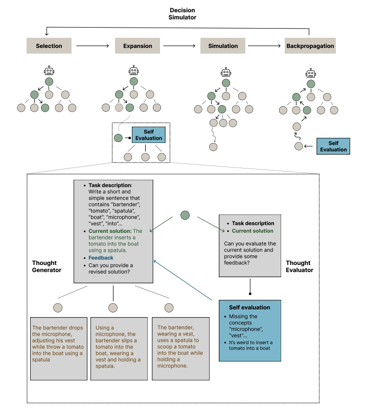

# Penalaran dengan Revisi Bertahap dan Pencarian untuk LLM

import {Bleed} from 'nextra-theme-docs'

<iframe width="100%"
  height="415px"
  src="https://www.youtube.com/embed/13fr5m6ezOM?si=DH3XYfzbMsg9aeIx" allow="accelerometer; autoplay; clipboard-write; encrypted-media; gyroscope; picture-in-picture"
  allowFullScreen
  />

Penelitian oleh [Chi dkk. (2024)](https://arxiv.org/abs/2404.05966) memperkenalkan cara baru untuk penalaran umum dan pencarian pada tugas-tugas yang bisa dipecah menjadi bagian-bagian kecil.

Mereka mengusulkan kerangka kerja berbasis grafik bernama THOUGHTSCULPT. Kerangka ini memungkinkan model bahasa besar (LLM) untuk memperbaiki dirinya sendiri secara berulang dan membangun jaringan pemikiran yang saling terkait.

Berbeda dengan pendekatan lain seperti Tree-of-thoughts yang menggunakan struktur pohon, THOUGHTSCULPT menggunakan metode Monte Carlo Tree Search (MCTS). MCTS membantu LLM mencari solusi dengan lebih efisien.

Cara kerja THOUGHTSCULPT bisa dibayangkan seperti ini:
1. Ada "penilai pemikiran" yang memberikan umpan balik tentang solusi sementara.
2. "Pembuat pemikiran" menghasilkan solusi-solusi potensial.
3. Kedua komponen ini bekerja sama untuk memperbaiki solusi yang ada.

Terakhir, ada "simulator keputusan" yang mencoba berbagai jalur pemikiran untuk menentukan mana yang paling menjanjikan.

THOUGHTSCULPT sangat cocok untuk tugas-tugas seperti pembuatan konten terbuka, penalaran bertahap, dan pemikiran kreatif. Ini karena kemampuannya untuk terus memperbaiki pemikiran.

Di masa depan, kita mungkin akan melihat lebih banyak pendekatan canggih yang menggunakan konsep dan algoritma pencarian serupa. Tujuannya adalah untuk meningkatkan kemampuan penalaran LLM dan memecahkan masalah yang membutuhkan pemikiran dan perencanaan kompleks. Penelitian ini penting untuk diikuti perkembangannya dalam tren riset LLM.

