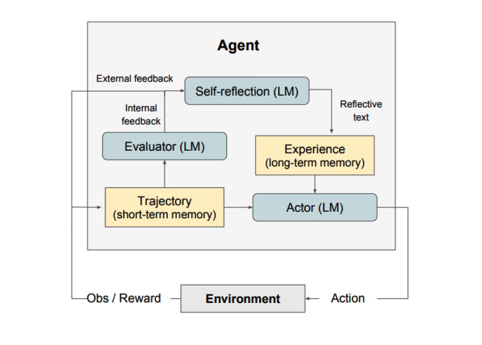
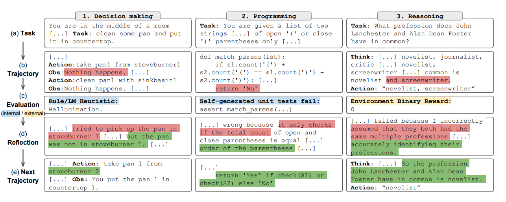
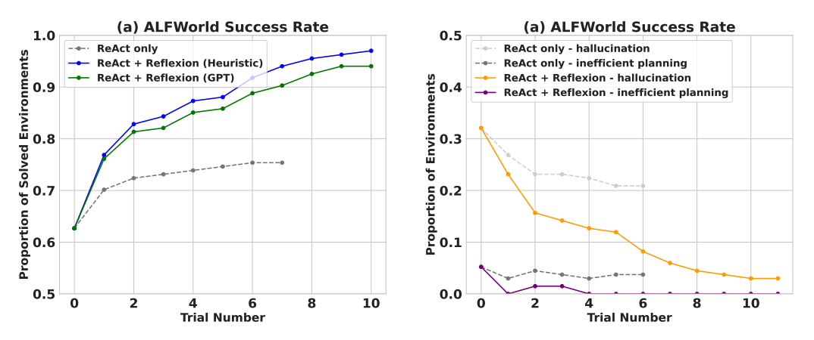
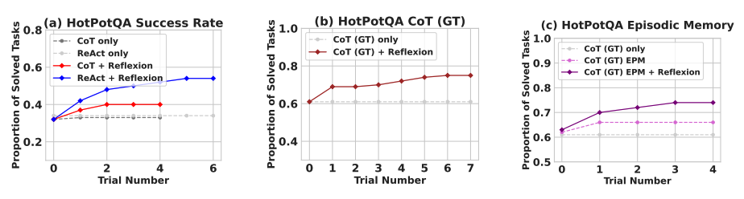
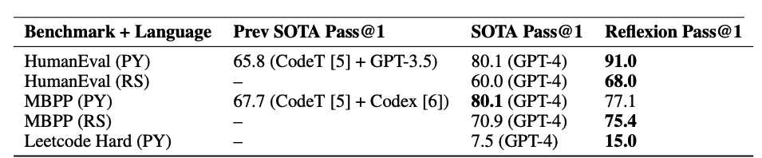

# Reflexion

Reflexion adalah sebuah kerangka kerja untuk memperkuat agen berbasis bahasa melalui umpan balik linguistik. Menurut [Shinn et al. (2023)](https://arxiv.org/pdf/2303.11366.pdf), "Reflexion adalah paradigma baru untuk penguatan 'verbal' yang menggunakan kebijakan sebagai encoding memori agen yang dipasangkan dengan pilihan parameter LLM (Large Language Model atau Model Bahasa Besar)."

Secara umum, Reflexion mengubah umpan balik (baik dalam bentuk bahasa bebas atau skalar) dari lingkungan menjadi umpan balik linguistik, yang juga disebut sebagai **refleksi diri**. Umpan balik ini kemudian diberikan sebagai konteks untuk agen LLM pada episode berikutnya. Hal ini membantu agen untuk belajar dengan cepat dan efektif dari kesalahan sebelumnya, yang mengarah pada peningkatan kinerja dalam berbagai tugas kompleks.

Seperti yang ditunjukkan pada gambar di atas, Reflexion terdiri dari tiga model berbeda:

- **Aktor**: Menghasilkan teks dan tindakan berdasarkan pengamatan keadaan. Aktor melakukan tindakan dalam suatu lingkungan dan menerima pengamatan yang menghasilkan trajektori (rangkaian tindakan). [Chain-of-Thought (CoT)](https://www.promptingguide.ai/techniques/cot) dan [ReAct](https://www.promptingguide.ai/techniques/react) digunakan sebagai model Aktor. Komponen memori juga ditambahkan untuk memberikan konteks tambahan kepada agen.

- **Evaluator**: Memberikan skor pada output yang dihasilkan oleh Aktor. Secara konkret, Evaluator menerima input berupa trajektori yang dihasilkan (juga disebut sebagai memori jangka pendek) dan menghasilkan skor reward. Fungsi reward yang berbeda digunakan tergantung pada tugas (LLM dan heuristik berbasis aturan digunakan untuk tugas pengambilan keputusan).

- **Refleksi Diri**: Menghasilkan petunjuk penguatan verbal untuk membantu Aktor dalam meningkatkan diri. Peran ini dicapai oleh LLM dan memberikan umpan balik berharga untuk percobaan di masa depan. Untuk menghasilkan umpan balik yang spesifik dan relevan, yang juga disimpan dalam memori, model refleksi diri menggunakan sinyal reward, trajektori saat ini, dan memori persisten. Pengalaman-pengalaman ini (disimpan dalam memori jangka panjang) dimanfaatkan oleh agen untuk meningkatkan pengambilan keputusan dengan cepat.

Singkatnya, langkah-langkah utama dalam proses Reflexion adalah: a) menentukan tugas, b) menghasilkan trajektori, c) mengevaluasi, d) melakukan refleksi, dan e) menghasilkan trajektori berikutnya. Gambar di bawah ini menunjukkan contoh bagaimana agen Reflexion dapat belajar untuk secara iteratif mengoptimalkan perilakunya untuk menyelesaikan berbagai tugas seperti pengambilan keputusan, pemrograman, dan penalaran. Reflexion memperluas kerangka kerja ReAct dengan menambahkan komponen evaluasi diri, refleksi diri, dan memori.

## Hasil

Hasil eksperimen menunjukkan bahwa agen Reflexion secara signifikan meningkatkan kinerja pada tugas pengambilan keputusan AlfWorld, pertanyaan penalaran di HotPotQA, dan tugas pemrograman Python di HumanEval.

Ketika dievaluasi pada tugas pengambilan keputusan berurutan (AlfWorld), ReAct + Reflexion secara signifikan mengungguli ReAct dengan menyelesaikan 130/134 tugas menggunakan teknik evaluasi diri Heuristik dan GPT untuk klasifikasi biner.

Reflexion secara signifikan mengungguli semua pendekatan dasar lainnya selama beberapa langkah pembelajaran. Untuk penalaran saja dan ketika menambahkan memori episodik yang terdiri dari trajektori terbaru, Reflexion + CoT mengungguli CoT saja dan CoT dengan memori episodik, masing-masing.

Seperti yang dirangkum dalam tabel di bawah ini, Reflexion umumnya mengungguli pendekatan state-of-the-art sebelumnya dalam penulisan kode Python dan Rust pada MBPP, HumanEval, dan Leetcode Hard.

## Kapan Menggunakan Reflexion?

Reflexion paling cocok digunakan dalam situasi berikut:

1. **Agen perlu belajar dari coba-coba**: Reflexion dirancang untuk membantu agen meningkatkan kinerja mereka dengan merefleksikan kesalahan masa lalu dan menggabungkan pengetahuan itu ke dalam keputusan masa depan. Ini membuatnya cocok untuk tugas-tugas di mana agen perlu belajar melalui coba-coba, seperti pengambilan keputusan, penalaran, dan pemrograman.

2. **Metode pembelajaran penguatan tradisional tidak praktis**: Metode pembelajaran penguatan (RL) tradisional sering memerlukan data pelatihan yang banyak dan penyetelan model yang mahal. Reflexion menawarkan alternatif yang lebih ringan yang tidak memerlukan penyetelan model bahasa yang mendasarinya, membuatnya lebih efisien dalam hal sumber daya data dan komputasi.

3. **Diperlukan umpan balik yang bernuansa**: Reflexion menggunakan umpan balik verbal, yang dapat lebih bernuansa dan spesifik daripada reward skalar yang digunakan dalam RL tradisional. Ini memungkinkan agen untuk lebih memahami kesalahannya dan membuat perbaikan yang lebih terarah dalam percobaan selanjutnya.

4. **Interpretabilitas dan memori eksplisit penting**: Reflexion memberikan bentuk memori episodik yang lebih dapat diinterpretasi dan eksplisit dibandingkan dengan metode RL tradisional. Refleksi diri agen disimpan dalam memorinya, memungkinkan analisis dan pemahaman yang lebih mudah tentang proses pembelajarannya.

Reflexion efektif dalam tugas-tugas berikut:

- **Pengambilan keputusan berurutan**: Agen Reflexion meningkatkan kinerja mereka dalam tugas AlfWorld, yang melibatkan navigasi melalui berbagai lingkungan dan menyelesaikan tujuan multi-langkah.
- **Penalaran**: Reflexion meningkatkan kinerja agen pada HotPotQA, sebuah dataset pertanyaan-jawaban yang memerlukan penalaran atas beberapa dokumen.
- **Pemrograman**: Agen Reflexion menulis kode yang lebih baik pada benchmark seperti HumanEval dan MBPP, mencapai hasil state-of-the-art dalam beberapa kasus.

Berikut beberapa keterbatasan Reflexion:

- **Ketergantungan pada kemampuan evaluasi diri**: Reflexion bergantung pada kemampuan agen untuk secara akurat mengevaluasi kinerjanya dan menghasilkan refleksi diri yang berguna. Ini bisa menjadi tantangan, terutama untuk tugas-tugas kompleks, tetapi diharapkan Reflexion akan menjadi lebih baik seiring waktu karena model terus meningkat dalam kemampuannya.
- **Keterbatasan memori jangka panjang**: Reflexion menggunakan jendela geser dengan kapasitas maksimum, tetapi untuk tugas yang lebih kompleks mungkin lebih menguntungkan untuk menggunakan struktur lanjutan seperti embedding vektor atau database SQL.
- **Keterbatasan generasi kode**: Ada keterbatasan dalam pengembangan berbasis tes dalam menentukan pemetaan input-output yang akurat (misalnya, fungsi generator non-deterministik dan output fungsi yang dipengaruhi oleh perangkat keras).

---

*Sumber gambar: [Reflexion: Language Agents with Verbal Reinforcement Learning](https://arxiv.org/pdf/2303.11366.pdf)*

## Referensi

- [Reflexion: Language Agents with Verbal Reinforcement Learning](https://arxiv.org/pdf/2303.11366.pdf)
- [Can LLMs Critique and Iterate on Their Own Outputs?](https://evjang.com/2023/03/26/self-reflection.html)
