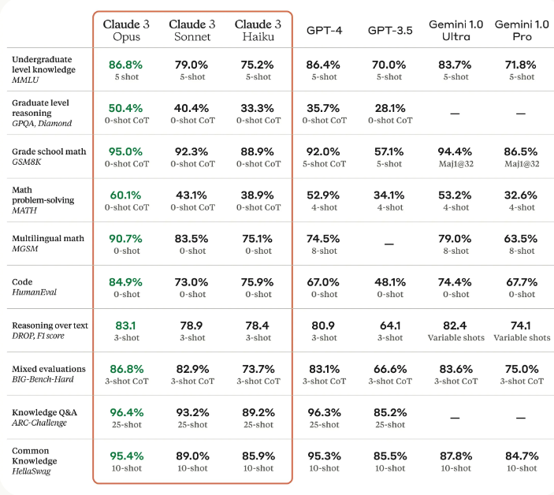
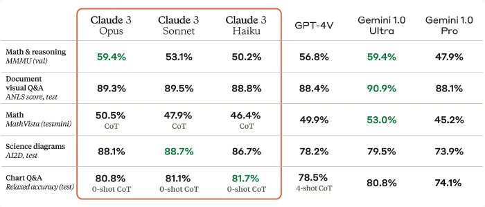

# Claude 3

Anthropic mengumumkan Claude 3, keluarga model baru mereka yang mencakup Claude 3 Haiku, Claude 3 Sonnet, dan Claude 3 Opus.

Claude 3 Opus (model terkuat) dilaporkan mengungguli GPT-4 dan semua model lainnya dalam berbagai tolok ukur umum seperti MMLU dan HumanEval.

## Hasil dan Kemampuan

Kemampuan Claude 3 meliputi penalaran tingkat lanjut, matematika dasar, analisis, ekstraksi data, peramalan, pembuatan konten, pembuatan kode, dan penerjemahan dalam bahasa non-Inggris seperti Spanyol, Jepang, dan Prancis. Tabel di bawah ini menunjukkan bagaimana Claude 3 dibandingkan dengan model lain dalam beberapa tolok ukur, dengan Claude 3 Opus mengungguli semua model yang disebutkan:

Claude 3 Haiku adalah model tercepat dan paling hemat biaya dalam seri ini. Claude 3 Sonnet 2x lebih cepat dari versi Claude sebelumnya, dan Opus secepat Claude 2.1 dengan kemampuan yang lebih unggul.

Model-model Claude 3 mendukung konteks hingga 200 ribu token, tetapi dapat diperluas hingga 1 juta token untuk pelanggan tertentu. Claude 3 Opus mencapai ingatan hampir sempurna dalam evaluasi "Jarum Dalam Jerami" (NIAH) yang mengukur kemampuan model untuk mengingat informasi dalam korpus besar dan memproses prompt konteks panjang secara efektif.

Model-model ini juga memiliki kemampuan visual yang kuat untuk memproses format seperti foto, grafik, dan diagram.

Anthropic juga mengklaim bahwa model-model ini memiliki pemahaman yang lebih mendalam terhadap permintaan dan lebih jarang menolak tugas. Opus juga menunjukkan peningkatan signifikan dalam menjawab pertanyaan faktual terbuka sambil mengurangi jawaban yang salah atau halusinasi (jawaban yang dibuat-buat). Model Claude 3 juga lebih baik daripada model Claude 2 dalam menghasilkan keluaran terstruktur seperti objek JSON.

## Referensi

- [Claude 3 Haiku, Claude 3 Sonnet, dan Claude 3 Opus](https://www.anthropic.com/news/claude-3-family)
- [Keluarga Model Claude 3: Opus, Sonnet, Haiku](https://www-cdn.anthropic.com/de8ba9b01c9ab7cbabf5c33b80b7bbc618857627/Model_Card_Claude_3.pdf)
