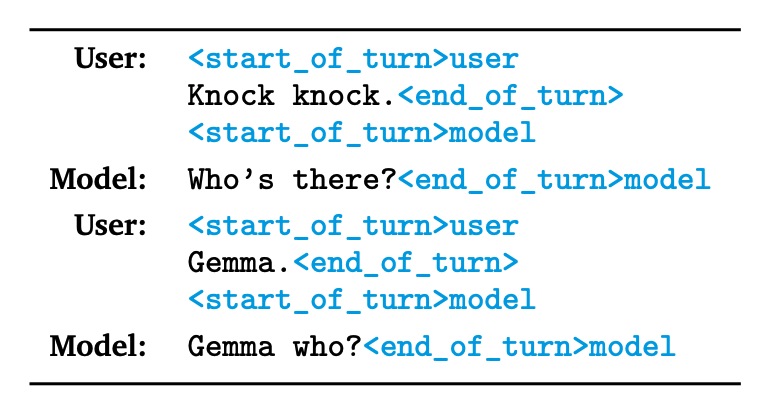
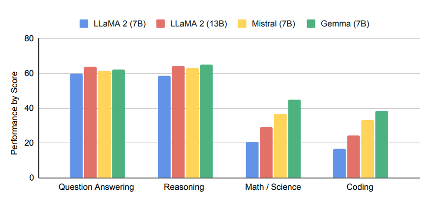
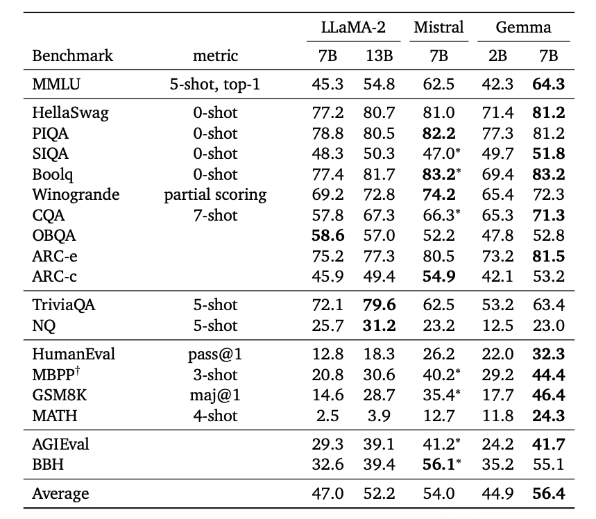
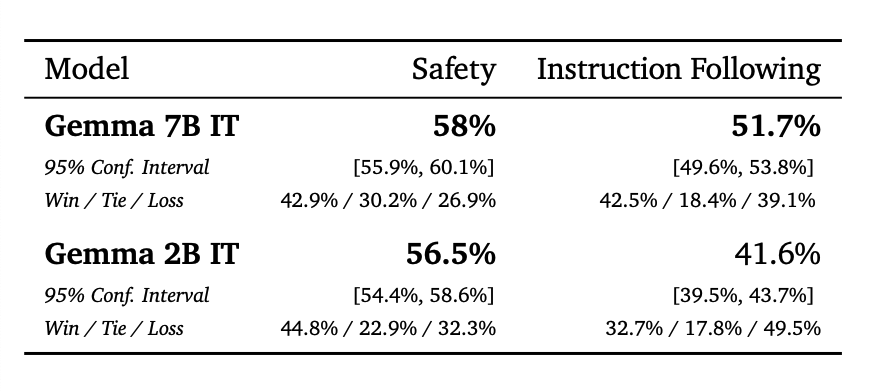
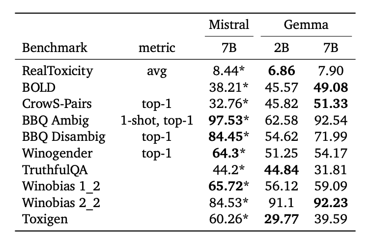

# Gemma

Google DeepMind merilis Gemma, serangkaian model bahasa terbuka yang terinspirasi oleh penelitian dan teknologi yang sama yang digunakan untuk menciptakan Gemini. Rilis model Gemma mencakup model 2B (dilatih pada 2T token) dan 7B (dilatih pada 6T token) termasuk checkpoint dasar dan yang telah dilatih dengan instruksi. Model-model ini dilatih dengan panjang konteks 8192 token dan umumnya mengungguli model Llama 2 7B dan Mistral 7B dalam beberapa tolok ukur.

Arsitektur model Gemma didasarkan pada decoder transformer dengan beberapa peningkatan, termasuk:
- Perhatian multi-query (digunakan oleh model 2B)
- Perhatian multi-kepala (digunakan oleh model 7B)
- Embedding RoPE
- Aktivasi GeGLU
- Lokasi normalizer

Menurut laporan teknis, Gemma 2B dan 7B dilatih pada 2T dan 6T token yang sebagian besar terdiri dari dokumen web, matematika, dan kode. Berbeda dengan Gemini, model-model ini tidak secara khusus dilatih untuk mendukung kemampuan multibahasa atau multimodal. Ukuran kosakatanya adalah 256K token dan menggunakan subset dari tokenizer SentencePiece milik Gemini, mempertahankan spasi dalam pemisahan digit, dan mengandalkan pengkodean tingkat byte untuk token yang tidak dikenal.

Model yang dilatih dengan instruksi disetel menggunakan fine-tuning terawasi pada campuran pasangan respons prompt sintetis dan buatan manusia yang hanya berupa teks, serta pembelajaran penguatan dari umpan balik manusia (RLHF). Model reward dilatih pada data preferensi berlabel dan kebijakan berdasarkan serangkaian prompt berkualitas tinggi. Perlu dicatat bahwa semua dataset yang digunakan hanya dalam bahasa Inggris. Model yang dilatih dengan instruksi juga menggunakan token kontrol pemformatan khusus untuk menunjukkan peran dan giliran dalam percakapan.



## Hasil

Seperti yang ditunjukkan dalam gambar di bawah, model Gemma 7B menunjukkan kinerja yang kuat pada tugas-tugas terkait matematika, sains, dan kode. Skor tersebut sesuai dengan skor rata-rata pada evaluasi tolok ukur akademik yang dikelompokkan berdasarkan kemampuan.



Gemma 7B mengungguli Llama 2 7B dan Mistral 7B dalam berbagai tolok ukur akademik dengan kinerja yang menonjol pada HumanEval, GSM8K, MATH, dan AGIEval, serta peningkatan kinerja dalam penalaran, dialog, matematika, dan kode.



Model Gemma 7B yang dilatih dengan instruksi juga mengungguli model Mistral-7B v0.2 Instruct dalam hal keamanan dan kepatuhan terhadap instruksi sebagaimana dievaluasi oleh manusia.



Gemma juga dievaluasi pada beberapa tolok ukur keamanan akademis dan dibandingkan dengan Mistral. Laporan teknis juga menyebutkan penggunaan teknik penghilangan bias dan pengujian red-team untuk berpotensi mengurangi risiko umum yang terkait dengan model bahasa besar (LLM). Anda dapat menemukan informasi lebih lanjut tentang cara mengembangkan Gemma secara bertanggung jawab di kartu model dan toolkit Responsible Generative AI.



## Format Prompt Gemma 7B

Model dasar Gemma tidak menggunakan format prompt khusus tetapi dapat diberikan prompt untuk melakukan tugas melalui prompting zero-shot/few-shot. Model Gemma Instruct menggunakan format berikut:

```
<start_of_turn>user
Buatlah fungsi Python yang mengalikan dua angka <end_of_turn>
<start_of_turn>model
```

Berikut adalah tabel yang menunjukkan token kontrol pemformatan yang relevan yang tersedia di Gemma:

| Konteks                         | Token Relevan      |
|---------------------------------|--------------------|
| Giliran pengguna                | `user`             |
| Giliran model                   | `model`            |
| Awal giliran percakapan         | `<start_of_turn>`  |
| Akhir giliran percakapan        | `<end_of_turn>`    |

Anda juga dapat menggunakan token kontrol khusus dalam konteks prompt pengguna multi-giliran sebagai berikut:

```markdown
<start_of_turn>user
Apa tempat yang bagus untuk berwisata di AS?<end_of_turn>
<start_of_turn>model
California.<end_of_turn>
<start_of_turn>user
Apa yang bisa saya lakukan di California?<end_of_turn>
<start_of_turn>model
```

## Cara Memberikan Prompt pada Gemma 7B

Memberikan prompt pada Gemma 7B secara efektif memerlukan kemampuan untuk menggunakan template prompt dengan benar. Dalam contoh-contoh berikut, kita akan membahas beberapa contoh yang mendemonstrasikan penggunaan template prompt Gemma 7B Instruct secara efektif untuk berbagai tugas.

### Prompting Zero-shot

Seperti halnya dengan model lain, Anda dapat memanfaatkan kemampuan zero-shot Gemma dengan memberikan prompt sederhana seperti berikut:

```markdown
<start_of_turn>user
Jelaskan mengapa langit berwarna biru<end_of_turn>
<start_of_turn>model
```

### Prompting Zero-shot dengan Prompt Sistem

Menambahkan peran sistem atau prompt sistem membantu mengarahkan LLM dengan lebih baik. Meskipun tidak ada peran sistem eksplisit di Gemma, Anda dapat menambahkan instruksi tambahan sebagai bagian dari prompt sebagai berikut:

```markdown
<start_of_turn>user
Jawab pertanyaan berikut dengan cara yang ringkas dan informatif:

Jelaskan mengapa langit berwarna biru<end_of_turn>
<start_of_turn>model
```

Dalam contoh di atas, kita menambahkan "Jawab pertanyaan berikut dengan cara yang ringkas dan informatif:" sebagai instruksi tambahan atau prompt sistem untuk mengarahkan model dengan lebih baik.

### Bermain Peran

Kita juga dapat menguji kemampuan bermain peran Gemma, yang merupakan kemampuan yang berguna tidak hanya untuk mempersonalisasi respons model tetapi juga untuk membangun agen LLM yang lebih kompleks dan spesifik domain.

Prompt:
```
<start_of_turn>user
Anda adalah seorang guru kelas 2 SD yang membantu. Bantu seorang siswa kelas 2 SD untuk menjawab pertanyaan dengan cara yang singkat dan jelas.

Jelaskan mengapa langit berwarna biru<end_of_turn>
<start_of_turn>model
```

### Penalaran

Anda dapat memunculkan kemampuan penalaran Gemma dengan menggunakan prompting chain-of-thought zero-shot sebagai berikut:

Prompt:
```markdown
<start_of_turn>user
Pikirkan dan tuliskan penalaran Anda langkah demi langkah sebelum menjawab.

Jelaskan mengapa langit berwarna biru.<end_of_turn>
<start_of_turn>model
```

Perlu diperhatikan bahwa model Gemma dapat menghasilkan format markdown secara otomatis. Kami telah mengedit format teks sedikit untuk tujuan demonstrasi dan kesederhanaan, tetapi kontennya persis seperti yang direspons oleh model.

## Sumber Daya dan Integrasi

Berikut adalah beberapa sumber daya dan integrasi yang menjadi bagian dari rilis Gemma:

- Notebook Colab dan Kaggle
- Model Hugging Face
- MaxText
- NVIDIA NeMo
- TensorRT-LLM
- Gemma 7B tersedia di NVIDIA AI Playground

Menurut rilis blog resmi, Ketentuan Penggunaan mengizinkan penggunaan dan distribusi komersial yang bertanggung jawab untuk semua organisasi, terlepas dari ukurannya.

## Referensi

- [Gemma: Memperkenalkan model terbuka mutakhir baru](https://blog.google/technology/developers/gemma-open-models/)
- [Gemma: Model Terbuka Berdasarkan Penelitian dan Teknologi Gemini](https://storage.googleapis.com/deepmind-media/gemma/gemma-report.pdf)
- [Toolkit Responsible Generative AI](https://ai.google.dev/responsible)
- [Decoding Transformer Cepat: Satu Write-Head Sudah Cukup](https://arxiv.org/abs/1911.02150)
- [Roformer: Transformer yang Ditingkatkan dengan embedding posisi rotary](https://arxiv.org/abs/2104.09864)
- [Varian GLU meningkatkan transformer](https://arxiv.org/abs/2002.05202)
- [Normalisasi lapisan root mean square](http://arxiv.org/abs/1910.07467)

