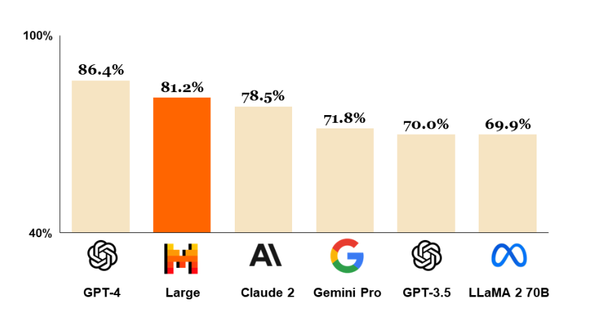
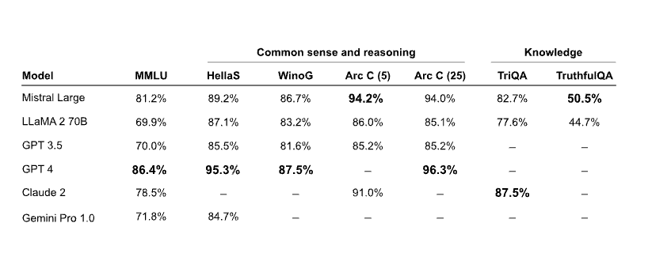
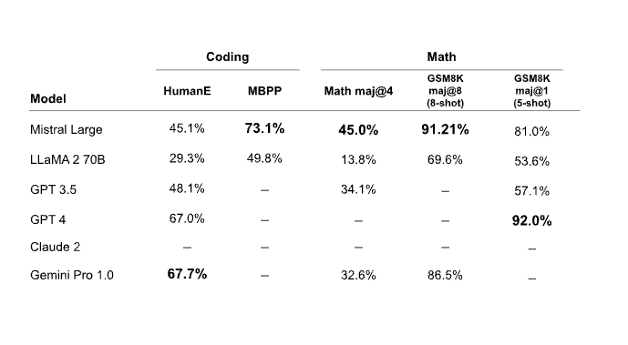
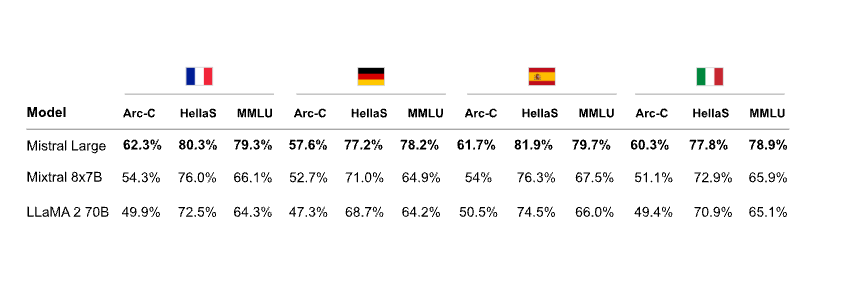

# Mistral Large

Mistral AI meluncurkan Mistral, model bahasa besar (LLM) paling canggih mereka dengan kemampuan multibahasa, penalaran, matematika, dan pembuatan kode yang kuat. Mistral Large tersedia melalui platform Mistral yang disebut la Plataforme dan Microsoft Azure. Anda juga dapat mencobanya di aplikasi chat baru mereka, [le Chat](https://chat.mistral.ai/).

Berikut adalah grafik yang menunjukkan bagaimana Mistral Large dibandingkan dengan LLM kuat lainnya seperti GPT-4 dan Gemini Pro. Mistral Large menempati peringkat kedua setelah GPT-4 pada benchmark MMLU dengan skor 81,2%.

## Kemampuan Mistral Large

Kemampuan dan kekuatan Mistral Large meliputi:

- Jendela konteks 32K token (unit terkecil dalam teks yang diproses oleh model)
- Memiliki kemampuan multibahasa alami (fasih dalam bahasa Inggris, Prancis, Spanyol, Jerman, dan Italia)
- Kemampuan yang kuat dalam penalaran, pengetahuan, matematika, dan benchmark koding
- Mendukung pemanggilan fungsi dan format JSON secara alami
- Model latensi rendah bernama Mistral Small juga dirilis
- Memungkinkan pengembang merancang kebijakan moderasi dengan kemampuan mengikuti instruksi yang tepat

### Penalaran dan Pengetahuan

Tabel di bawah ini menunjukkan bagaimana kinerja Mistral Large pada benchmark penalaran dan pengetahuan umum. Meskipun masih tertinggal dari GPT-4, Mistral Large unggul dibandingkan LLM lain seperti Claude 2 dan Gemini Pro 1.0.

### Matematika & Pembuatan Kode

Tabel berikut menunjukkan kinerja Mistral Large pada benchmark matematika dan koding umum. Mistral Large menunjukkan kinerja yang kuat pada benchmark Math dan GSM8K, tetapi kinerjanya masih di bawah model seperti Gemini Pro dan GPT-4 dalam hal benchmark koding.

### Kemampuan Multibahasa

Tabel di bawah ini mendemonstrasikan kinerja Mistral Large pada benchmark penalaran multibahasa. Mistral Large mengungguli Mixtral 8x7B dan Llama 2 70B dalam semua bahasa, termasuk Prancis, Jerman, Spanyol, dan Italia.

## Mistral Small

Selain peluncuran Mistral Large, model yang lebih kecil dan dioptimalkan bernama Mistral Small juga diumumkan. Mistral Small dioptimalkan untuk beban kerja latensi rendah dan mengungguli Mixtral 8x7B. Mistral AI melaporkan bahwa model ini memiliki kemampuan yang kuat dalam hal RAG-enablement (kemampuan untuk meningkatkan respons dengan informasi eksternal), pemanggilan fungsi, dan format JSON.

## Endpoint Mistral dan Pemilihan Model

[Di sini](https://docs.mistral.ai/platform/endpoints/) adalah daftar semua endpoint yang disediakan oleh Mistral AI. 

Mistral AI juga telah menerbitkan [panduan](https://docs.mistral.ai/guides/model-selection/) komprehensif tentang pemilihan model yang lebih baik ketika mempertimbangkan trade-off antara kinerja dan biaya.

*Sumber gambar: https://mistral.ai/news/mistral-large/*
