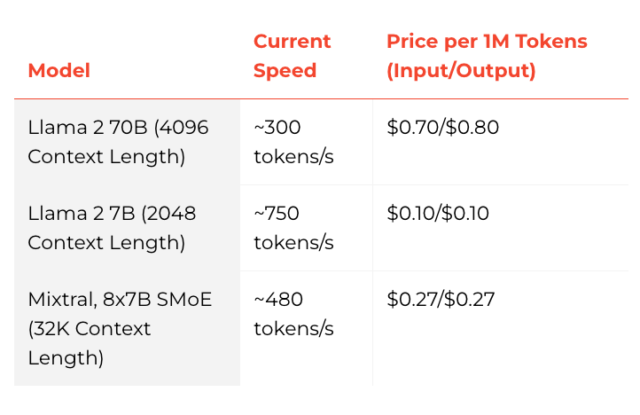

# Apa itu Groq?

[Groq](https://groq.com/) baru-baru ini menjadi sorotan sebagai salah satu solusi inferensi LLM (Large Language Model atau Model Bahasa Besar) tercepat yang tersedia saat ini. Banyak praktisi LLM tertarik untuk mengurangi latensi (waktu jeda) dalam respons LLM. Latensi adalah metrik penting yang perlu dioptimalkan untuk memungkinkan aplikasi AI yang bekerja secara real-time. Saat ini, banyak perusahaan bersaing dalam bidang inferensi LLM.

Groq adalah salah satu perusahaan inferensi LLM yang mengklaim, pada saat artikel ini ditulis, memiliki kinerja inferensi 18 kali lebih cepat di [Papan Peringkat LLMPerf Anyscale](https://github.com/ray-project/llmperf-leaderboard) dibandingkan dengan penyedia berbasis cloud terkemuka lainnya. Saat ini, Groq menyediakan model-model seperti Llama 2 70B dari Meta AI dan Mixtral 8x7B melalui API mereka. Model-model ini didukung oleh Groq LPU™ Inference Engine yang dibangun dengan perangkat keras khusus mereka yang dirancang untuk menjalankan LLM, disebut unit pemrosesan bahasa (LPU).

Menurut FAQ Groq, LPU membantu mengurangi waktu yang diperlukan untuk menghitung setiap kata, sehingga memungkinkan pembuatan urutan teks yang lebih cepat. Anda dapat membaca lebih lanjut tentang detail teknis LPU dan manfaatnya dalam makalah mereka yang memenangkan penghargaan ISCA pada tahun [2020](https://wow.groq.com/groq-isca-paper-2020/) dan [2022](https://wow.groq.com/isca-2022-paper/).

Berikut adalah grafik yang menunjukkan kecepatan dan harga untuk model-model mereka:

Grafik di bawah ini membandingkan throughput token keluaran (token/detik) yang merupakan rata-rata jumlah token keluaran yang dihasilkan per detik. Angka-angka dalam grafik menunjukkan rata-rata throughput token keluaran (berdasarkan 150 permintaan) dari penyedia inferensi LLM pada model Llama 2 70B.

Faktor penting lainnya dalam inferensi LLM, terutama untuk aplikasi streaming, disebut waktu ke token pertama (TTFT atau Time to First Token). TTFT adalah durasi waktu yang diperlukan LLM untuk menghasilkan token pertama. Berikut adalah grafik yang menunjukkan kinerja berbagai penyedia inferensi LLM:

Anda dapat membaca lebih lanjut tentang kinerja inferensi LLM Groq di Papan Peringkat LLMPerf Anyscale [di sini](https://wow.groq.com/groq-lpu-inference-engine-crushes-first-public-llm-benchmark/).

