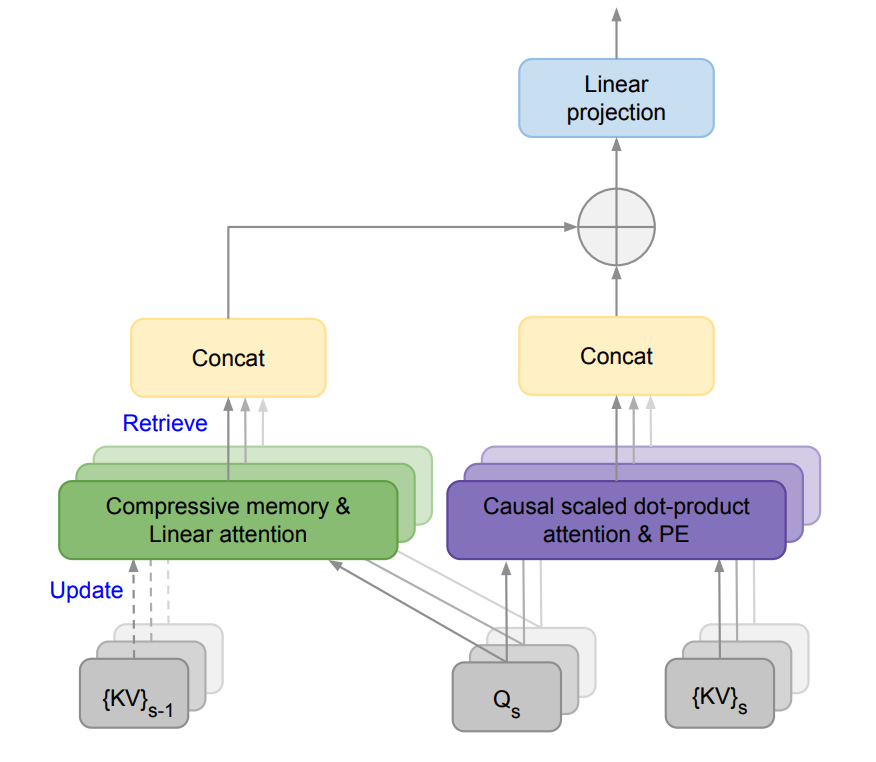

# Transformer Konteks Tak Terbatas yang Efisien

import {Bleed} from 'nextra-theme-docs'

<iframe width="100%"
  height="415px"
  src="https://www.youtube.com/embed/tOaTaQ8ZGRo?si=pFP-KiLe63Ppl9Pd" allow="accelerometer; autoplay; clipboard-write; encrypted-media; gyroscope; picture-in-picture"
  allowFullScreen
  />

Sebuah [makalah](https://arxiv.org/abs/2404.07143) baru dari Google mengintegrasikan memori kompresif ke dalam lapisan perhatian dot-product standar.

Tujuannya adalah untuk memungkinkan model bahasa besar (LLM) berbasis Transformer memproses input yang sangat panjang dengan penggunaan memori dan komputasi yang terbatas.

Mereka mengusulkan teknik perhatian baru yang disebut Infini-attention, yang menggabungkan modul memori kompresif ke dalam mekanisme perhatian standar.

Teknik ini menggabungkan perhatian lokal termasker (masked local attention) dan perhatian linier jangka panjang (long-term linear attention) ke dalam satu blok Transformer. Hal ini memungkinkan model Infini-Transformer menangani ketergantungan kontekstual jangka pendek dan panjang secara efisien.

Pendekatan ini mengalahkan model dasar dalam pemodelan bahasa konteks panjang dengan rasio kompresi memori 114 kali lipat!

Mereka juga menunjukkan bahwa LLM berukuran 1 miliar parameter dapat secara alami menangani urutan sepanjang 1 juta token, dan model 8 miliar parameter mencapai hasil terbaik baru dalam tugas meringkas buku sepanjang 500 ribu token.

Mengingat pentingnya LLM dengan konteks panjang, memiliki sistem memori yang efektif dapat membuka kemampuan penalaran, perencanaan, adaptasi berkelanjutan, dan kemampuan-kemampuan baru yang belum pernah terlihat sebelumnya dalam LLM.

