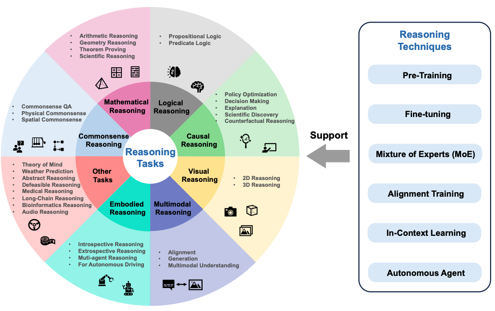
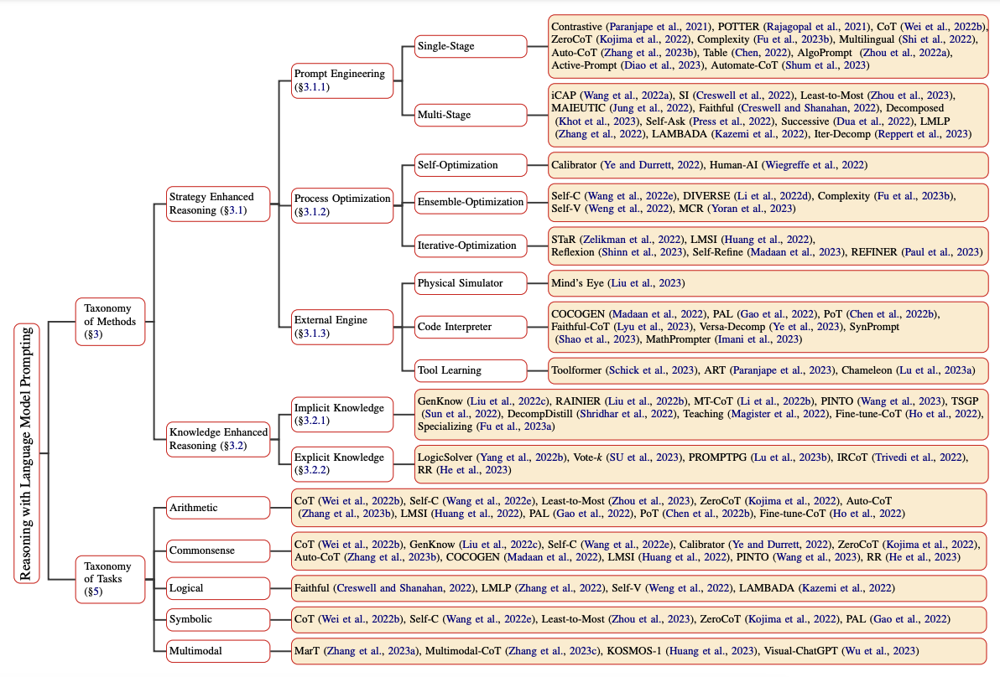
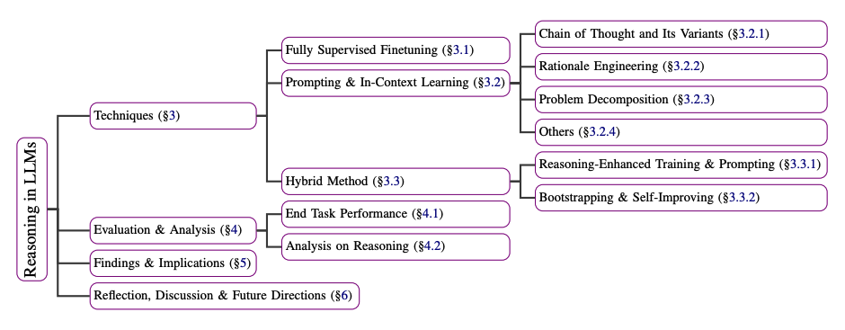

# Penalaran LLM (Model Bahasa Besar)

Dalam beberapa tahun terakhir, model bahasa besar (LLM) telah membuat kemajuan signifikan dalam berbagai tugas. Baru-baru ini, LLM menunjukkan potensi untuk memiliki kemampuan penalaran ketika dikembangkan dalam skala yang cukup besar. Berbagai jenis penalaran sangat penting untuk kecerdasan, tetapi belum sepenuhnya dipahami bagaimana model AI dapat mempelajari dan memanfaatkan kemampuan ini untuk memecahkan masalah yang kompleks. Ini adalah area yang menjadi fokus dan investasi besar bagi banyak laboratorium penelitian.

## Penalaran dengan Model Dasar
[Sun dkk. (2023)](https://arxiv.org/abs/2312.11562) baru-baru ini mengusulkan gambaran umum tentang penalaran dengan model dasar yang berfokus pada kemajuan terbaru dalam berbagai tugas penalaran. Pekerjaan ini juga berfokus pada pandangan yang lebih luas tentang penalaran yang mencakup model multimodal dan agen bahasa otonom.

Tugas penalaran bisa meliputi tugas-tugas seperti penalaran matematika, penalaran logis, penalaran sebab-akibat, penalaran visual, dan lainnya. Gambar berikut menunjukkan gambaran umum tugas penalaran yang dibahas dalam makalah survei, termasuk teknik penalaran untuk model dasar seperti pelatihan penyelarasan dan pembelajaran dalam konteks.

*Sumber gambar: [Sun dkk., 2023](https://arxiv.org/pdf/2212.09597.pdf)*

## Bagaimana Penalaran Dapat Dimunculkan dalam LLM?
Penalaran dalam LLM dapat dimunculkan dan ditingkatkan menggunakan berbagai pendekatan prompting (pemberian petunjuk). [Qiao dkk. (2023)](https://arxiv.org/abs/2212.09597) mengkategorikan penelitian metode penalaran menjadi dua cabang, yaitu strategi yang ditingkatkan penalarannya dan penalaran yang ditingkatkan pengetahuannya. Strategi penalaran meliputi rekayasa prompt, optimasi proses, dan mesin eksternal. Misalnya, strategi prompting satu tahap termasuk [Chain-of-Thought](https://www.promptingguide.ai/techniques/cot) (Rantai Pemikiran) dan [Active-Prompt](https://www.promptingguide.ai/techniques/activeprompt) (Prompt Aktif). Taksonomi lengkap penalaran dengan prompting model bahasa dapat ditemukan dalam makalah tersebut dan dirangkum dalam gambar di bawah ini:

*Sumber gambar: [Qiao dkk., 2023](https://arxiv.org/pdf/2212.09597.pdf)*

[Huang dkk. (2023)]() juga menjelaskan ringkasan teknik untuk meningkatkan atau memunculkan penalaran dalam LLM seperti GPT-3. Teknik-teknik ini berkisar dari menggunakan model fine-tuning yang sepenuhnya diawasi yang dilatih pada dataset penjelasan hingga metode prompting seperti rantai pemikiran, dekomposisi masalah, dan pembelajaran dalam konteks. Berikut adalah ringkasan teknik yang dijelaskan dalam makalah tersebut:

*Sumber gambar: [Huang dkk., 2023](https://arxiv.org/pdf/2212.10403.pdf)*

## Apakah LLM Dapat Bernalar dan Merencanakan?
Ada banyak perdebatan tentang apakah LLM dapat bernalar dan merencanakan. Baik penalaran maupun perencanaan adalah kemampuan penting untuk membuka aplikasi kompleks dengan LLM seperti dalam domain robotika dan agen otonom. Sebuah [makalah posisi oleh Subbarao Kambhampati (2024)](https://arxiv.org/abs/2403.04121) membahas topik penalaran dan perencanaan untuk LLM.

Berikut adalah ringkasan kesimpulan penulis:

>Untuk meringkas, tidak ada yang saya baca, verifikasi, atau lakukan yang memberikan alasan meyakinkan untuk percaya bahwa LLM melakukan penalaran/perencanaan, seperti yang umumnya dipahami. Yang mereka lakukan sebaliknya, berbekal pelatihan skala web, adalah bentuk pengambilan perkiraan universal, yang, seperti yang telah saya jelaskan, terkadang dapat disalahartikan sebagai kemampuan penalaran.

## Referensi

- [Penalaran dengan Prompting Model Bahasa: Sebuah Survei](https://arxiv.org/abs/2212.09597)
- [Menuju Penalaran dalam Model Bahasa Besar: Sebuah Survei](https://arxiv.org/abs/2212.10403)
- [Dapatkah Model Bahasa Besar Bernalar dan Merencanakan?](https://arxiv.org/abs/2403.04121)
- [Memikirkan Kembali Batas Penalaran LLM: Apakah Diskusi Multi-Agen adalah Kuncinya?](https://arxiv.org/abs/2402.18272v1)
- [Awesome LLM Reasoning](https://github.com/atfortes/Awesome-LLM-Reasoning)
