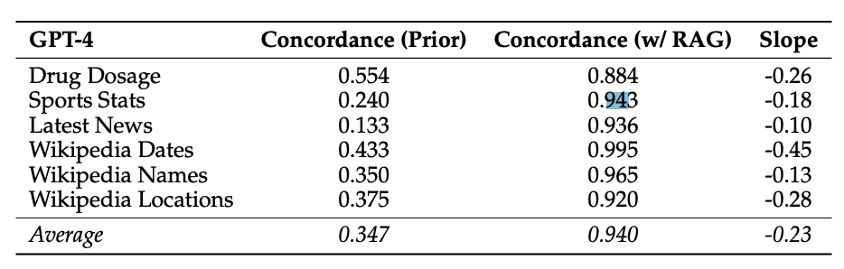

# Seberapa Setia Model RAG?

import {Bleed} from 'nextra-theme-docs'

<iframe width="100%"
  height="415px"
  src="https://www.youtube.com/embed/eEU1dWVE8QQ?si=b-qgCU8nibBCSX8H" allow="accelerometer; autoplay; clipboard-write; encrypted-media; gyroscope; picture-in-picture"
  allowFullScreen
  />

Penelitian terbaru oleh [Wu dkk. (2024)](https://arxiv.org/abs/2404.10198) bertujuan untuk mengukur "tarik-menarik" antara RAG (Retrieval-Augmented Generation) dan pengetahuan internal model bahasa besar (LLM).

Penelitian ini berfokus pada GPT-4 dan LLM lainnya dalam menjawab pertanyaan.

Hasilnya menunjukkan bahwa dengan memberikan informasi yang benar dari pencarian, sebagian besar kesalahan model dapat diperbaiki (akurasi 94%).

*Sumber: [Wu dkk. (2024)](https://arxiv.org/abs/2404.10198)*

Ketika dokumen yang diberikan berisi lebih banyak informasi yang salah dan pengetahuan internal LLM lemah, LLM cenderung mengutip informasi yang salah tersebut. Namun, LLM lebih tahan terhadap informasi salah jika mereka memiliki pengetahuan internal yang kuat.

Penelitian ini juga melaporkan bahwa "semakin jauh informasi yang dimodifikasi dari pengetahuan awal model, semakin kecil kemungkinan model akan memilihnya."

Banyak pengembang dan perusahaan menggunakan sistem RAG dalam produksi mereka. Penelitian ini menekankan pentingnya menilai risiko saat menggunakan LLM dengan berbagai jenis informasi kontekstual yang mungkin berisi informasi pendukung, bertentangan, atau bahkan salah sama sekali.

Penjelasan sederhana:
- RAG adalah teknik yang menggabungkan pencarian informasi dengan kemampuan LLM untuk menghasilkan jawaban.
- Penelitian ini ingin tahu seberapa baik LLM dapat membedakan informasi yang benar dan salah saat menggunakan RAG.
- Hasilnya menunjukkan bahwa LLM cukup baik dalam menggunakan informasi yang benar, tetapi bisa terpengaruh oleh informasi yang salah jika pengetahuan internalnya lemah.
- Ini penting untuk diketahui karena banyak aplikasi AI menggunakan RAG, dan kita perlu berhati-hati dengan kualitas informasi yang diberikan ke AI.

