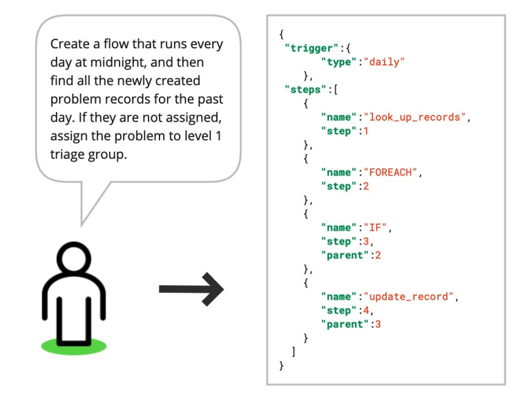

# Mengurangi Halusinasi dalam Keluaran Terstruktur melalui RAG

import {Bleed} from 'nextra-theme-docs'

<iframe width="100%"
  height="415px"
  src="https://www.youtube.com/embed/TUL5guqZejw?si=Doc7lzyAY-SKr21L" allow="accelerometer; autoplay; clipboard-write; encrypted-media; gyroscope; picture-in-picture"
  allowFullScreen
  />

Para peneliti di ServiceNow baru-baru ini membagikan [sebuah makalah](https://arxiv.org/abs/2404.08189) yang membahas cara menerapkan sistem RAG (Retrieval-Augmented Generation) yang efisien untuk tugas-tugas dengan keluaran terstruktur.

Sistem RAG ini menggabungkan model bahasa berukuran kecil dengan pengambil (retriever) yang sangat kecil. Hal ini menunjukkan bahwa RAG dapat memungkinkan penerapan sistem berbasis LLM (Large Language Model) yang kuat dalam lingkungan dengan sumber daya terbatas, sekaligus mengurangi masalah seperti halusinasi dan meningkatkan keandalan keluaran.

Makalah ini membahas aplikasi yang sangat berguna di dunia bisnis, yaitu menerjemahkan persyaratan dalam bahasa alami menjadi alur kerja (dalam format JSON). Tugas ini dapat meningkatkan produktivitas secara signifikan, namun masih ada banyak ruang untuk optimalisasi lebih lanjut (misalnya, menggunakan decoding spekulatif atau menggunakan YAML alih-alih JSON).

Makalah ini memberikan wawasan yang berharga dan tips praktis tentang cara mengembangkan sistem RAG yang efektif untuk dunia nyata.

Berikut adalah penjelasan sederhana tentang beberapa istilah teknis yang digunakan:

1. RAG (Retrieval-Augmented Generation): Teknik yang menggabungkan pengambilan informasi dengan generasi teks untuk menghasilkan respons yang lebih akurat dan relevan.

2. Halusinasi: Dalam konteks AI, halusinasi mengacu pada situasi di mana model menghasilkan informasi yang tidak akurat atau tidak ada dalam data pelatihan.

3. LLM (Large Language Model): Model bahasa besar yang dilatih pada data teks dalam jumlah besar untuk memahami dan menghasilkan bahasa manusia.

4. JSON (JavaScript Object Notation): Format data yang mudah dibaca oleh manusia dan mudah diproses oleh mesin, sering digunakan untuk pertukaran data.

5. YAML (YAML Ain't Markup Language): Format serialisasi data yang dirancang agar mudah dibaca oleh manusia, sering digunakan sebagai alternatif untuk JSON.

Dengan menggunakan sistem RAG, perusahaan dapat memanfaatkan kekuatan LLM bahkan dengan sumber daya terbatas, sambil mengurangi risiko kesalahan dan meningkatkan keandalan output. Ini membuka peluang baru untuk otomatisasi dan peningkatan efisiensi dalam berbagai tugas bisnis.

