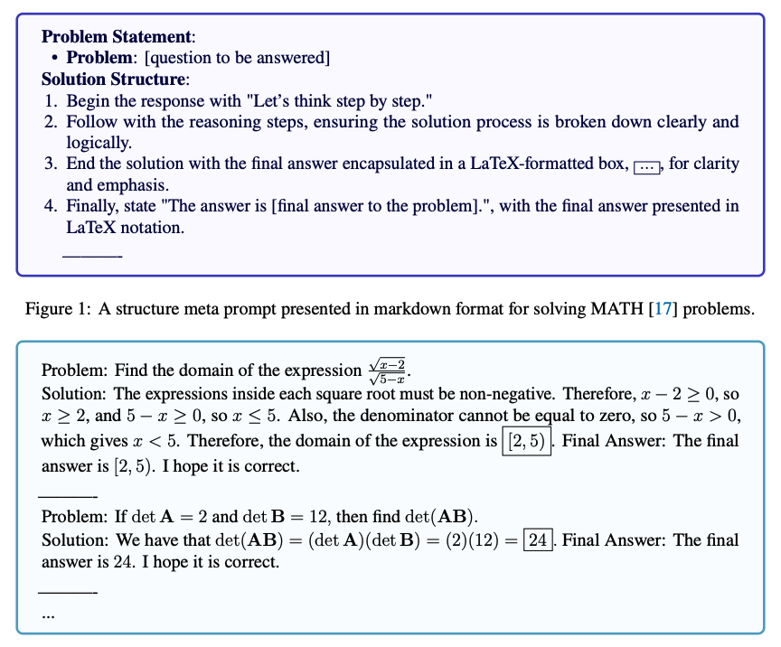

# Meta Prompting (Prompt Meta)

## Pendahuluan

Meta Prompting adalah teknik prompting tingkat lanjut yang berfokus pada aspek struktural dan sintaksis dari tugas dan masalah, bukan pada detail konten spesifik. Tujuan dari meta prompting adalah untuk membangun cara yang lebih abstrak dan terstruktur dalam berinteraksi dengan model bahasa besar (Large Language Models atau LLMs), dengan menekankan bentuk dan pola informasi daripada metode tradisional yang berpusat pada konten.

## Karakteristik Utama

Menurut [Zhang dkk. (2024)](https://arxiv.org/abs/2311.11482), karakteristik utama meta prompting dapat dirangkum sebagai berikut:

**1. Berorientasi struktur**: Mengutamakan format dan pola masalah serta solusi daripada konten spesifik.

**2. Fokus pada sintaksis**: Menggunakan sintaksis sebagai template panduan untuk respons atau solusi yang diharapkan.

**3. Contoh abstrak**: Menggunakan contoh yang diabstraksi sebagai kerangka kerja, mengilustrasikan struktur masalah dan solusi tanpa fokus pada detail spesifik.

**4. Serbaguna**: Dapat diterapkan di berbagai bidang, mampu memberikan respons terstruktur untuk berbagai macam masalah.

**5. Pendekatan kategorikal**: Mengambil inspirasi dari teori tipe untuk menekankan kategorisasi dan pengaturan logis komponen dalam sebuah prompt.

## Keunggulan dibandingkan Few-Shot Prompting

[Zhang dkk., 2024](https://arxiv.org/abs/2311.11482) melaporkan bahwa meta prompting dan few-shot prompting berbeda dalam hal meta prompting berfokus pada pendekatan yang lebih berorientasi struktur, sedangkan few-shot prompting menekankan pendekatan yang digerakkan oleh konten.

Contoh berikut yang diambil dari [Zhang dkk. (2024)](https://arxiv.org/abs/2311.11482) menunjukkan perbedaan antara meta prompt terstruktur dan few-shot prompt untuk menyelesaikan masalah dari benchmark MATH:

Keunggulan Meta Prompting dibandingkan few-shot prompting meliputi:

**1. Efisiensi token**: Mengurangi jumlah token yang diperlukan dengan fokus pada struktur daripada konten detail.

**2. Perbandingan yang adil**: Memberikan pendekatan yang lebih adil untuk membandingkan model pemecahan masalah yang berbeda dengan meminimalkan pengaruh contoh spesifik.

**3. Efektivitas zero-shot**: Dapat dianggap sebagai bentuk zero-shot prompting, di mana pengaruh contoh spesifik diminimalkan.

## Aplikasi

Dengan berfokus pada pola struktural pemecahan masalah, Meta Prompting menawarkan peta jalan yang jelas untuk menavigasi topik-topik kompleks, meningkatkan kemampuan penalaran LLM di berbagai bidang.

Penting untuk dicatat bahwa meta prompting juga mengasumsikan bahwa LLM memiliki pengetahuan bawaan tentang tugas atau masalah spesifik yang sedang dibahas. Karena LLM dapat menggeneralisasi ke tugas-tugas yang belum pernah dilihat sebelumnya, mungkin saja mereka dapat dimanfaatkan dengan meta prompting, tetapi kinerja mungkin menurun untuk tugas-tugas yang lebih unik dan baru, seperti halnya dengan zero-shot prompting.

Aplikasi di mana meta prompting dapat bermanfaat termasuk, namun tidak terbatas pada, tugas-tugas penalaran kompleks, pemecahan masalah matematika, tantangan coding, dan pertanyaan teoretis.

